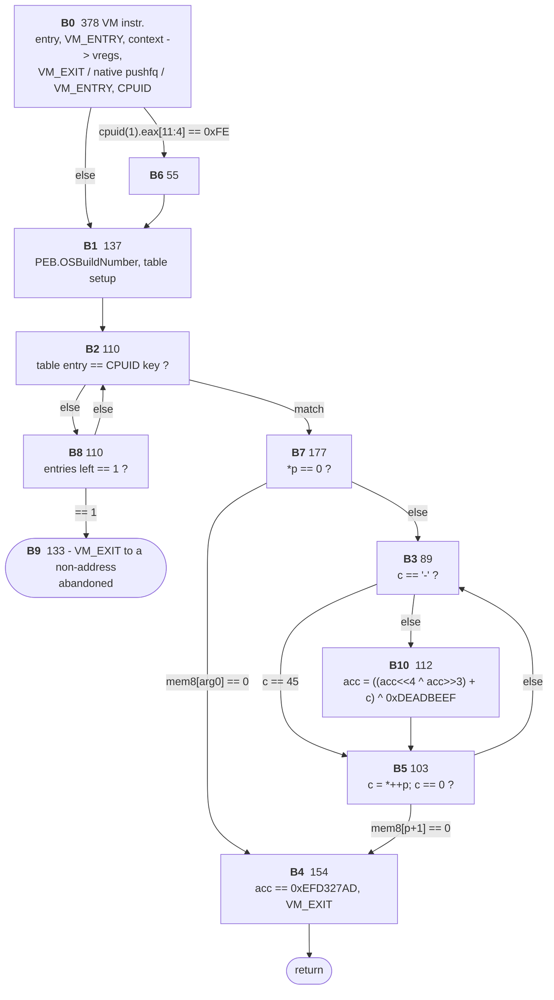

## A Short Story Before Starting

As part of the raise of the AIs, I decided to use Claude to help me learn about doing reverse engineering to strong protectors (in this case VMProtect), and also review if it was possible to use a tool I'm working on in order to do the analysis of those protections. This tool is called dragon-tales, and this post is about an analysis of a simple VMProtect using dragon-tales together with the support of Claude Code.

Recently I have also seen a talk by [@mr_phrazer](https://x.com/mr_phrazer) and [@nicolodev](https://x.com/nicolodev) called ["Deobfuscation in the Age of Agentic Reverse Engineering"](https://www.youtube.com/watch?v=3-gJ6EUFoKM), which also covers this topic in a very cool way!

But for now, let's jump to the post that it is what everyone is waiting for!

## Overview


*Reverse-engineering, naming, and devirtualizing a VMProtect x64 virtual machine with **dragon-tales** (an LLVM-based lifter with the IGNIL intermediate language, symbolic execution, and Z3), plus capstone, Unicorn, z3py and Binary Ninja.*

This is the full story of taking one VMProtect-virtualized function apart: from
the VM entry stub, through the dispatcher and all 256 handlers, to a clean LLVM-IR
recompilation of the original function, and finally to a native executable that
behaves exactly like the one VMProtect was given. It is told in the order it
happened, including the wall the first attempt ran into (Part 8) and what that
wall turned out to be once the bytecode was explored without a trace (Parts
9–13, added on September 22). Everything here is generated from the binary
by the scripts listed at the end; the complete per-handler catalogue (all 256
handlers, four views each) is in the companion appendix **[`Dragon power against VMProtect - Handlers.md`](https://github.com/Fare9/Dragons-vs-VMs/blob/main/Dragon%20power%20against%20VMProtect%20-%20Handlers.md)**.

**Companion repo.** Every binary, script, Binary Ninja database and generated
file referenced below lives in **[Fare9/Dragons-vs-VMs](https://github.com/Fare9/Dragons-vs-VMs)** —
the links throughout this post point straight into it.

**Target.** [`serial_check.vmp.exe`](https://github.com/Fare9/Dragons-vs-VMs/blob/main/serial_check.vmp.exe), a tiny x64 crackme with exactly one function
virtualized (`check_serial`, all other VMProtect protections off for a clean
study). Its logic: hash a serial and compare to `0xEFD327AD`; the documented key
is `VMP-2026-DEMO`. Image base `0x140000000`; the VM lives in section `./A(` at
`0x1400a9000`; the handler table is at `0x1400e93f0`.

**The four views.** For every handler we look at it four ways and cross-check
them: the raw **x86** (capstone) with junk marked; dragon-tales' **IGNIL** after
simplification and dead-store elimination; the optimized **LLVM IR**; and a
**symbolic** run where the VM registers are named and every changed slot is read
back as a `z3.simplify`-ed expression. A fifth view, Binary Ninja's IL, is
available via a console script.


## Part 1 — Getting in: from `check_serial` to VM_ENTRY


`main` still calls `check_serial` at its original address. The function body is gone;
what is left is a jump to a two-instruction stub, and the stub calls the VM:

```asm
0x140007300: jmp 0x1400ab6e0            ; check_serial's first (and only) instruction
0x1400ab6e0: push 0x59f91842            ; "key": encodes where this function's bytecode lives
0x1400ab6e5: call 0x1400e5000           ; VM_ENTRY
```

Every virtualized function gets its own stub with its own key; they all call the
same VM_ENTRY. So the key is the only per-function input to the VM.

### 1.1 VM_ENTRY in assembly (junk marked)

VM_ENTRY is 70 instructions long. dragon-tales lifts them to 519 IGNIL operations;
after `simplify()` and dead-store elimination with only the VM's own state registers
declared live, 107 operations remain. Instructions that contributed nothing to those
107 are junk. Here is the listing with junk removed (the full one is in
[`post_views.json`](https://github.com/Fare9/Dragons-vs-VMs/blob/main/scripts/post_views.json) under `entry`):

```asm
0x1400e5000: pushfq                        ; save RFLAGS
0x1400e5005: push r15
0x1400e500d: push r11
0x1400e5017: movabs r11, 0                 ; relocation delta (0: image not relocated)
0x1400e5025: push r10
0x1400e5027: push rdi
0x1400e5029: push r9
0x1400e502b: push rbx
0x1400e5037: mov [rsp+0x38], rbp           ; RBP goes INTO the return-address slot
0x1400e5047: lea rbp, [rsp-0x40]           ; RBP = where RSP will be after 8 more pushes
0x1400e504c: movabs r9, 0x100000000        ; high part of the image base
0x1400e5058: push rcx
0x1400e505d: lea rbx, [rbp-0x200]          ; 0x200 bytes below the VM stack ...
0x1400e506e: and bl, 0xf0                  ; ... aligned to 16: the VM register file
0x1400e5074: push rax
0x1400e507c: push r8
0x1400e5086: push r13
0x1400e5088: push r14
0x1400e5097: push rdx
0x1400e50a3: push r11                      ; the relocation delta (0)
0x1400e50a8: push rsi
0x1400e50a9: mov esi, [rsp+0x80]           ; ESI = the key pushed by the stub
0x1400e50b3: neg esi
0x1400e50b8: inc esi                       ; esi = 1 - key
0x1400e50c5: bswap esi
0x1400e50c7: not esi                       ; esi = ~bswap(1 - key)
0x1400e50d4: add rsi, r11                  ; + relocation delta
0x1400e50e4: add rsi, r9                   ; + 0x100000000  -> RSI = VIP
0x1400e50ee: mov [rsp+0x80], r12           ; R12 overwrites the key slot
0x1400e50f6: mov rsp, rbx                  ; RSP = VM register file
0x1400e50fc: lea r11, [rip+0x42ed]         ; R11 = handler table (0x1400e93f0)
```

The 39 instructions not shown (`cmp sil, 0x2c`, `bsr r9w, cx`, `ror ch, cl`,
`shrd ecx, r13d, 0xa`, ...) only write registers that are overwritten before being
read, or flags that the next real instruction clobbers. DSE proves that; no
pattern matching involved.

### 1.2 VM_ENTRY symbolically

Run the same IGNIL through dragon-tales' `SymbolicExecutor` with `RSP` symbolized as
`NATIVE_SP` and the stack contents as byte symbols, read the registers back as Z3
terms, re-parse them in z3py and call `z3.simplify()`:

```
RBP (VM_SP)   = NATIVE_SP - 0x78
RSP (VM_REGS) = Concat(Extract(63, 8, NATIVE_SP - 0x278), Extract(7, 4, 0x88 + Extract(7, 0, NATIVE_SP)), 0)
                  i.e. (NATIVE_SP - 0x278) & ~0xf
RSI (VIP)     = Concat(1, ~(1 - b[NATIVE_SP+0x8]), ~Extract(15, 8, 1 - d[NATIVE_SP+0x8]),
                          ~Extract(23, 16, 1 - d[NATIVE_SP+0x8]), ~Extract(31, 24, 1 - d[NATIVE_SP+0x8]))
                  i.e. 0x1_00000000 | bswap32(~(1 - key))        (key = d[NATIVE_SP+0x8])
R11 (HTABLE)  = 0x1400e93f0
R9            = 0x100000000
R8            = 0
```

Substituting the stub's key `0x59f91842` into the RSI term and simplifying again
gives **VIP = 0x14018f959**, inside `./A(`. That is where this function's bytecode
starts (Part 6 decodes it).

The stores the executor saw give the saved native context, i.e. the initial layout
of the VM stack (`VM_SP` = `NATIVE_SP - 0x78`):

| VM_SP offset | content | | VM_SP offset | content |
|---|---|---|---|---|
| +0x00 | RSI | | +0x48 | R9 |
| +0x08 | 0 (relocation delta) | | +0x50 | RDI |
| +0x10 | RDX | | +0x58 | R10 |
| +0x18 | R14 | | +0x60 | R11 |
| +0x20 | R13 | | +0x68 | R15 |
| +0x28 | R8 | | +0x70 | RFLAGS (from `pushfq`) |
| +0x30 | RAX | | +0x78 | RBP (overwrote the return address) |
| +0x38 | RCX | | +0x80 | R12 (overwrote the key) |
| +0x40 | RBX | | | |

The four registers that define the machine from here on:

| native | role | symbol used below |
|---|---|---|
| RBP | VM stack pointer; handlers push/pop through `[rbp]` | `VM_SP` |
| RSP | VM register file base; `[rsp + idx]` is virtual register `idx` | `VM_REGS` |
| RSI | virtual instruction pointer into the bytecode | `VIP` |
| R11 | handler table base (rel32 entries) | `HTABLE` |

Note the trick: the native stack pointer is reused as the register-file base, so
handlers can still use native `push`/`pop` (they do, for `pushfq`/`pop reg`),
which lands in the 0x200-byte area below the register file and never collides
with VM state.


## Part 2 — Moving between handlers: the dispatcher


```asm
0x1400e5103: movzx r8d, byte ptr [rsi]       ; opcode = *VIP
0x1400e5107: add rsi, 1                       ; VIP++
0x1400e510e: mov cx, 0x6ebf                   ; junk
0x1400e5112: cmc                              ; junk
0x1400e5113: movsxd rcx, dword ptr [r11+r8*4] ; rel32 entry from the handler table
0x1400e5117: add rcx, r11                     ; absolute handler address
0x1400e511a: push rcx
0x1400e511b: ret                              ; dispatch
```

That is the whole fetch/decode/dispatch loop: one byte of opcode, a table lookup,
`push`/`ret` instead of an indirect jump. Every handler ends with `jmp` back to one
of two places:

- **`0x1400e5103` (fetch)**, used by handlers that shrink or keep the VM stack.
- **`0x1400e511c` (check)**, used by handlers that grow it. That block is a guard:

```asm
0x1400e511c: lea rcx, [rsp+0x180]            ; VM_REGS + 0x180
0x1400e512c: cmp rbp, rcx
0x1400e512f: ja 0x1400e5103                  ; VM_SP still > VM_REGS+0x180 -> fetch
; otherwise the VM stack is about to run into the register file: move the register file
0x1400e5135: mov r8, rsp                      ; source = old register file
0x1400e513e: mov ecx, 0x100                   ; its size
0x1400e5143: lea rdx, [rbp-0x80]
0x1400e514f: sub rdx, rcx
0x1400e5159: and rdx, ~0xf                    ; new register file = (VM_SP - 0x180) & ~0xf
0x1400e5160: mov rsp, rdx
...          push rsi ; pushfq ; mov rsi, r8 ; mov rdi, rdx ; cld
0x1400e519f: rep movsb                        ; copy the 0x100-byte register file down
...          popfq ; pop rsi
0x1400e51b8: jmp 0x1400e5103
```

So "moving through the handlers" is: fetch -> handler -> (optional stack guard) ->
fetch. There is no visible switch and no return address; the bytecode is the only
thing that says what runs next. In a static disassembler each handler looks like it
"flows into" the dispatcher, which is why the CFG of this VM is a star with the
fetch block in the middle.

Inside a handler the shape is always the same: read operands (from the VM stack via
`[rbp]`, from the bytecode via `[rsi]`), do one operation, write results (to `[rbp]`
or `[rsp+idx]`), adjust `rbp`/`rsi`, jump back. Between those instructions VMProtect
inserts junk: flag-only instructions (`cmc`, `stc`, `test`, `cmp`), writes to
registers that are dead, undocumented encodings (the `sal` alias of `shl`, `C0 /6`),
and the occasional `xchg reg, reg` with itself.


## Part 3 — The instruction set, as recovered


All 256 opcode slots resolve to 256 distinct handler addresses, and those collapse
into the classes below. "operand" is the number of bytecode bytes the handler
consumes after the opcode byte (recovered as the constant in `VIP' - VIP`); "VM_SP
delta" is the constant in `VM_SP' - VM_SP`. Names are assigned from the recovered
effect, not from the assembly.

| class | handlers | operand | VM_SP delta | effect (symbolic, after `z3.simplify`) |
|---|---:|---:|---:|---|
| `PUSH_IMM8/16/32/64` | 4/6/3/2 | 1/2/4/8 | -2/-2/-4/-8 | `[VM_SP-w] = imm` (8-bit is zero-extended into a 16-bit slot) |
| `PUSH_VR8/16/32/64` | 3/8/4/8 | 2 | -2/-2/-4/-8 | `[VM_SP-w] = vreg[operand]` (register index is a 16-bit operand here) |
| `POP_VR8/16/32/64` | 6/8/5/7 | 2/2/1/1 | +2/+2/+4/+8 | `vreg[operand] = [VM_SP]` (8/16-bit forms take a 16-bit index, 32/64-bit an 8-bit one) |
| `LOAD8/16/32/64` | 8/7/4/11 | 0 | +6/+6/+4/0 | pop pointer `P`, push `[P]` (8-bit result lands in a 16-bit slot) |
| `STORE8/16/32/64` | 6/6/9/5 | 0 | +10/+10/+12/+16 | pop pointer `P` and value, `[P] = value` |
| `PUSH_VSP16/32/64` | 3/5/4 | 0 | -2/-4/-8 | push `VM_SP` (low 16/32 bits, or all of it) |
| `SET_VSP16/32/64` | 2/3/2 | 0 | n/a | `VM_SP = [VM_SP]` (`mov bp/ebp/rbp, [rbp]`) |
| `ADD8/16/32/64` | 1/3/5/2 | 0 | -6/-6/-4/0 | pop a, b; push `a + b`, then push RFLAGS |
| `SUB8/16/32/64` | 2/1/2/2 | 0 | same | push `a - b`, then RFLAGS |
| `NOR8/16/32/64` | 1/1/3/4 | 0 | same | push `~(a \| b)` (`not a; not b; and`), then RFLAGS |
| `NAND8/16/32/64` | 2/4/3/3 | 0 | same | push `~a \| ~b` (`not a; not b; or`), then RFLAGS |
| `SHL8/16/32/64` | 5/5/2/4 | 0 | -6/-6/-6/-6 | pop value and (16-bit) count; push `value << (count & 31\|63)`, then RFLAGS |
| `SHR8/16/32/64` | 2/5/3/3 | 0 | same | logical right shift, then RFLAGS |
| `SHLD16/32/64`, `SHRD16/32/64` | 1/4/4, 1/1/3 | 0 | -4/-2/+2 | double-precision shifts, then RFLAGS |
| `MUL32/64`, `IMUL16/32/64`, `DIV64` | 2/2, 4/4/1, 5 | 0 | -8..+8 | one-operand multiply/divide, RDX:RAX pushed |
| `NOT32` | 1 | 0 | | |
| `CPUID` | 2 | 0 | -8 | pop leaf/subleaf, push EAX,EBX,ECX,EDX |
| `RDTSC` | 3 | 0 | -8 | push EDX:EAX |
| `VM_CALL` | 4 | 1 | +0x20 (for 4 args) | call the native function pointer on top of the VM stack with N Win64 args |
| `VM_EXIT` | 7 | 0 | n/a | pop the whole native context from the VM stack and `ret` |

Every class exists in several polymorphic copies (different registers, different
junk, different tail); the copies never differ in effect. There are no dedicated
AND/OR/XOR/NEG handlers: like every VMProtect build, this one synthesizes them in
bytecode from NOR/NAND and ADD.

Three things in this table were only settled later, by executing the bytecode
(Part 9), and are worth correcting here:

- **`VM_EXIT` is seven handlers, but one of them is not an exit.** Six of the
  seven really restore the native context and `ret` (their effect reads
  `VM_SP = q[VM_SP+0x70]`, `VIP = q[VM_SP+0x0]`, `HTABLE = q[VM_SP+0x58]`, all
  fifteen registers popped). The one at `0x1400e6a80` (slot `0x57`) does only
  `VM_SP += 8; VIP = q[VM_SP+0x0]` and falls straight into the dispatcher: it
  is the VM's **jump**, `VM_JUMP`, and the tail `ret` the catalogue saw is the
  dispatcher's own `push rcx; ret`. Part 7's stream ends every block with it
  (`VM_EXIT operand=0x57`), and Part 9.3 shows how it is handled.
- **There is no conditional-jump handler at all.** A branch is `VM_JUMP` on a
  target the bytecode computed arithmetically from a saved RFLAGS word, with
  `NOR` / `NAND` / `ADD` and shifts. The condition is data, not an opcode.
- **One `LOAD64` copy is segment-relative.** `0x1400e5755` (slot `0x11`) is
  `mov rdi, gs:[r10]`, not `mov rdi, [r10]`: it is how the prologue reads the
  TEB (`gs:[0x60]` = PEB, Part 10.1). Same effect on the VM stack, different
  address space.

The first-pass catalog, built from LLVM IR shape alone,
had 40 handlers in an "ARITH_FLAGS?" bucket, 23 unknown and 16 unrecoverable. The
symbolic view is what split them, and it also corrected several wrong labels: the
old "LOAD8" group stores a byte (it is STORE8), "MUL" was ADD64, "XOR64" was NAND64,
"STORE?" was RDTSC, "LOAD32" (one of two groups) was CPUID, "VM_EXIT?" was
VM_CALL. Section 6 says why.


## Part 4 — Reading handlers in four views

Each handler in [`Dragon power against VMProtect - Handlers.md`](https://github.com/Fare9/Dragons-vs-VMs/blob/main/Dragon%20power%20against%20VMProtect%20-%20Handlers.md) has: the capstone listing with junk marked, the
IGNIL after simplify+DSE, the optimized LLVM IR, and the symbolic effect (dragon's
Z3 term, then the z3py-simplified form). Here is how to read them, on real
handlers.

Below are a few representative handlers. The full set of 256 is in
**[`Dragon power against VMProtect - Handlers.md`](https://github.com/Fare9/Dragons-vs-VMs/blob/main/Dragon%20power%20against%20VMProtect%20-%20Handlers.md)**.

### Handler `0x1400e5427` — `POP_VR64`  (opcode slot 0x4f)

- old catalog name: `POP_VR64`; exit: **fetch** -> `0x1400e5103`; 9 instructions, 5 live; IGNIL 92 ops -> 10 after simplify+DSE; operand bytes: 1; VM_SP delta: 8
- **effect** (symbolic, after z3.simplify):

```
VM_SP += 0x8
VIP += 0x1
[VM_REGS+0x18]:64 = q[VM_SP+0x0]
scratch: RBX=Concat(0, b[VIP+0x0]), R9=q[VM_SP+0x0]
```

<details><summary>x86 (capstone) — junk marked</summary>

```asm
0x1400e5427: 4c8b4c2500         mov r9, qword ptr [rbp + riz]
0x1400e542c: 6633db             xor bx, bx   ; junk (dead per DSE)
0x1400e542f: 4881c508000000     add rbp, 8
0x1400e5436: 480fbcd9           bsf rbx, rcx   ; junk (dead per DSE)
0x1400e543a: 413af1             cmp sil, r9b   ; junk (dead per DSE)
0x1400e543d: c0fbb5             sar bl, 0xb5   ; junk (dead per DSE)
0x1400e5440: 0fb61e             movzx ebx, byte ptr [rsi]
0x1400e5443: 4881c601000000     add rsi, 1
0x1400e544f: 4c890c1c           mov qword ptr [rsp + rbx], r9
```
</details>

<details><summary>IGNIL (dragon-tales lift_trace -> simplify -> DSE)</summary>

```
IGNILBlock @ 0x1400e5427
  t1:i64 = LOAD(RBP:i64)  ; @0x1400e5427
  R9:i64 = COPY(t1:i64)  ; @0x1400e5427
  t6:i64 = ADD(RBP:i64, 0x8:i64)  ; @0x1400e542f
  RBP:i64 = COPY(t6:i64)  ; @0x1400e542f
  t34:i8 = LOAD(RSI:i64)  ; @0x1400e5440
  EBX:i32 = ZEXT(t34:i8)  ; @0x1400e5440
  t36:i64 = ADD(RSI:i64, 0x1:i64)  ; @0x1400e5443
  RSI:i64 = COPY(t36:i64)  ; @0x1400e5443
  t48:i64 = ADD(RSP:i64, RBX:i64)  ; @0x1400e544f
  STORE(t48:i64, R9:i64)  ; @0x1400e544f
```
</details>

<details><summary>LLVM IR (dragon-tales LLVMLifter, optimized)</summary>

```llvm
bb_5369648167:
  %0 = getelementptr i8, ptr %regs, i64 32   ; RSP = VM_REGS
  %1 = load i64, ptr %0, align 4
  %2 = getelementptr i8, ptr %regs, i64 40   ; RBP = VM_SP
  %3 = load i64, ptr %2, align 4
  %4 = getelementptr i8, ptr %regs, i64 48   ; RSI = VIP
  %5 = load i64, ptr %4, align 4
  %6 = getelementptr i8, ptr %mem, i64 %3
  %7 = load i64, ptr %6, align 4
  %8 = getelementptr i8, ptr %mem, i64 %5
  %9 = load i8, ptr %8, align 1
  %10 = zext i8 %9 to i64
  %11 = getelementptr i8, ptr %mem, i64 %1
  %12 = getelementptr i8, ptr %11, i64 %10
  store i64 %7, ptr %12, align 4
  %13 = icmp sgt i64 %5, -1
  %14 = add i64 %5, 1
  %15 = xor i64 %14, %5
  %16 = icmp slt i64 %15, 0
  %17 = and i1 %13, %16
  %18 = zext i1 %17 to i8
  %.lobit = lshr i64 %14, 63
  %19 = trunc nuw nsw i64 %.lobit to i8
  %20 = icmp eq i64 %14, 0
  %21 = zext i1 %20 to i8
  %22 = add i64 %3, 8
  %23 = getelementptr i8, ptr %regs, i64 24   ; RBX
  store i64 %10, ptr %23, align 4
  store i64 %1, ptr %0, align 4
  store i64 %22, ptr %2, align 4
  store i64 %14, ptr %4, align 4
  %24 = getelementptr i8, ptr %regs, i64 72   ; R9
  store i64 %7, ptr %24, align 4
  %25 = getelementptr i8, ptr %regs, i64 136   ; CF
  store i8 %21, ptr %25, align 1
  %26 = getelementptr i8, ptr %regs, i64 139   ; ZF
  store i8 %21, ptr %26, align 1
  %27 = getelementptr i8, ptr %regs, i64 140   ; SF
  store i8 %19, ptr %27, align 1
  %28 = getelementptr i8, ptr %regs, i64 141   ; OF
  store i8 %18, ptr %28, align 1
  ret void
```
</details>

<details><summary>Symbolic (dragon-tales SymbolicExecutor -> Z3, then z3.simplify)</summary>

```
run ok=True complete=True ops=92 solver_queries=3
RBX (RBX)
   dragon: (concat #x00000000000000 |b[VIP+0x0]|)
   z3    : Concat(0, b[VIP+0x0])
RBP (VM_SP)
   dragon: (bvadd VM_SP #x0000000000000008)
   z3    : 8 + VM_SP
RSI (VIP)
   dragon: (bvadd VIP #x0000000000000001)
   z3    : 1 + VIP
R9 (R9)
   dragon: |q[VM_SP+0x0]|
   z3    : q[VM_SP+0x0]
[VM_REGS+0x18]:64
   dragon: |q[VM_SP+0x0]|
   z3    : q[VM_SP+0x0]
```
</details>

_Binary Ninja IL: not generated yet — run [`scripts/binja_dump_il.py`](https://github.com/Fare9/Dragons-vs-VMs/blob/main/scripts/binja_dump_il.py) in the BN console, then re-run this script._

---

### Handler `0x1400e5598` — `PUSH_IMM64`  (opcode slot 0x3f)

- old catalog name: `PUSH_IMM64`; exit: **check** -> `0x1400e511c`; 5 instructions, 4 live; IGNIL 53 ops -> 7 after simplify+DSE; operand bytes: 8; VM_SP delta: -8
- **effect** (symbolic, after z3.simplify):

```
VM_SP -= 0x8
VIP += 0x8
[VM_SP-0x8]:64 = q[VIP+0x0]
scratch: R9=q[VIP+0x0]
```

<details><summary>x86 (capstone) — junk marked</summary>

```asm
0x1400e5598: 4c8b0e             mov r9, qword ptr [rsi]
0x1400e559b: 4881c608000000     add rsi, 8
0x1400e55a2: 4185f9             test r9d, edi   ; junk (dead per DSE)
0x1400e55aa: 4881ed08000000     sub rbp, 8
0x1400e55b1: 4c894c2500         mov qword ptr [rbp + riz], r9
```
</details>

<details><summary>IGNIL (dragon-tales lift_trace -> simplify -> DSE)</summary>

```
IGNILBlock @ 0x1400e5598
  t1:i64 = LOAD(RSI:i64)  ; @0x1400e5598
  R9:i64 = COPY(t1:i64)  ; @0x1400e5598
  t3:i64 = ADD(RSI:i64, 0x8:i64)  ; @0x1400e559b
  RSI:i64 = COPY(t3:i64)  ; @0x1400e559b
  t17:i64 = SUB(RBP:i64, 0x8:i64)  ; @0x1400e55aa
  RBP:i64 = COPY(t17:i64)  ; @0x1400e55aa
  STORE(RBP:i64, R9:i64)  ; @0x1400e55b1
```
</details>

<details><summary>LLVM IR (dragon-tales LLVMLifter, optimized)</summary>

```llvm
bb_5369648536:
  %0 = getelementptr i8, ptr %regs, i64 48   ; RSI = VIP
  %1 = load i64, ptr %0, align 4
  %2 = getelementptr i8, ptr %regs, i64 56   ; RDI
  %3 = load i32, ptr %2, align 4
  %4 = getelementptr i8, ptr %mem, i64 %1
  %5 = load i64, ptr %4, align 4
  %6 = getelementptr i8, ptr %regs, i64 40   ; RBP = VM_SP
  %7 = load i64, ptr %6, align 4
  %8 = add i64 %7, -8
  %9 = getelementptr i8, ptr %mem, i64 %8
  store i64 %5, ptr %9, align 4
  %10 = sub i64 7, %7
  %11 = and i64 %7, %10
  %.lobit1 = lshr i64 %11, 63
  %12 = trunc nuw nsw i64 %.lobit1 to i8
  %.lobit = lshr i64 %8, 63
  %13 = trunc nuw nsw i64 %.lobit to i8
  %14 = icmp eq i64 %8, 0
  %15 = zext i1 %14 to i8
  %16 = icmp ult i64 %7, 8
  %17 = zext i1 %16 to i8
  %18 = add i64 %1, 8
  store i64 %8, ptr %6, align 4
  store i64 %18, ptr %0, align 4
  store i32 %3, ptr %2, align 4
  %19 = getelementptr i8, ptr %regs, i64 72   ; R9
  store i64 %5, ptr %19, align 4
  %20 = getelementptr i8, ptr %regs, i64 136   ; CF
  store i8 %17, ptr %20, align 1
  %21 = getelementptr i8, ptr %regs, i64 139   ; ZF
  store i8 %15, ptr %21, align 1
  %22 = getelementptr i8, ptr %regs, i64 140   ; SF
  store i8 %13, ptr %22, align 1
  %23 = getelementptr i8, ptr %regs, i64 141   ; OF
  store i8 %12, ptr %23, align 1
  ret void
```
</details>

<details><summary>Symbolic (dragon-tales SymbolicExecutor -> Z3, then z3.simplify)</summary>

```
run ok=True complete=True ops=53 solver_queries=2
RBP (VM_SP)
   dragon: (bvsub VM_SP #x0000000000000008)
   z3    : -0x8 + VM_SP
RSI (VIP)
   dragon: (bvadd VIP #x0000000000000008)
   z3    : 8 + VIP
R9 (R9)
   dragon: |q[VIP+0x0]|
   z3    : q[VIP+0x0]
[VM_SP-0x8]:64
   dragon: |q[VIP+0x0]|
   z3    : q[VIP+0x0]
```
</details>

_Binary Ninja IL: not generated yet — run [`scripts/binja_dump_il.py`](https://github.com/Fare9/Dragons-vs-VMs/blob/main/scripts/binja_dump_il.py) in the BN console, then re-run this script._

---

### Handler `0x1400e5737` — `LOAD64`  (opcode slot 0x04)

- old catalog name: `LOAD64`; exit: **fetch** -> `0x1400e5103`; 5 instructions, 3 live; IGNIL 10 ops -> 5 after simplify+DSE; operand bytes: 0; VM_SP delta: 0
- **effect** (symbolic, after z3.simplify):

```
[VM_SP+0x0]:64 = q[P+0x0]
scratch: RBX=q[P+0x0], R9=q[VM_SP+0x0]
```

<details><summary>x86 (capstone) — junk marked</summary>

```asm
0x1400e5737: 4c8b4c2500         mov r9, qword ptr [rbp + riz]
0x1400e573c: 0fb7df             movzx ebx, di   ; junk (dead per DSE)
0x1400e573f: 490fb7d9           movzx rbx, r9w   ; junk (dead per DSE)
0x1400e5743: 498b19             mov rbx, qword ptr [r9]
0x1400e574b: 48895c2500         mov qword ptr [rbp + riz], rbx
```
</details>

<details><summary>IGNIL (dragon-tales lift_trace -> simplify -> DSE)</summary>

```
IGNILBlock @ 0x1400e5737
  t1:i64 = LOAD(RBP:i64)  ; @0x1400e5737
  R9:i64 = COPY(t1:i64)  ; @0x1400e5737
  t3:i64 = LOAD(R9:i64)  ; @0x1400e5743
  RBX:i64 = COPY(t3:i64)  ; @0x1400e5743
  STORE(RBP:i64, RBX:i64)  ; @0x1400e574b
```
</details>

<details><summary>LLVM IR (dragon-tales LLVMLifter, optimized)</summary>

```llvm
bb_5369648951:
  %0 = getelementptr i8, ptr %regs, i64 40   ; RBP = VM_SP
  %1 = load i64, ptr %0, align 4
  %2 = getelementptr i8, ptr %mem, i64 %1
  %3 = load i64, ptr %2, align 4
  %4 = getelementptr i8, ptr %mem, i64 %3
  %5 = load i64, ptr %4, align 4
  %6 = getelementptr i8, ptr %regs, i64 56   ; RDI
  %7 = load i16, ptr %6, align 2
  store i64 %5, ptr %2, align 4
  %8 = getelementptr i8, ptr %regs, i64 24   ; RBX
  store i64 %5, ptr %8, align 4
  store i64 %1, ptr %0, align 4
  store i16 %7, ptr %6, align 2
  %9 = getelementptr i8, ptr %regs, i64 72   ; R9
  store i64 %3, ptr %9, align 4
  ret void
```
</details>

<details><summary>Symbolic (dragon-tales SymbolicExecutor -> Z3, then z3.simplify)</summary>

```
run ok=True complete=True ops=10 solver_queries=3
RBX (RBX)
   dragon: |q[P+0x0]|
   z3    : q[P+0x0]
R9 (R9)
   dragon: |q[VM_SP+0x0]|
   z3    : q[VM_SP+0x0]
[VM_SP+0x0]:64
   dragon: |q[P+0x0]|
   z3    : q[P+0x0]
```
</details>

_Binary Ninja IL: not generated yet — run [`scripts/binja_dump_il.py`](https://github.com/Fare9/Dragons-vs-VMs/blob/main/scripts/binja_dump_il.py) in the BN console, then re-run this script._

---

### Handler `0x1400e5c89` — `ADD32`  (opcode slot 0x00)

- old catalog name: `ADD32`; exit: **check** -> `0x1400e511c`; 17 instructions, 8 live; IGNIL 110 ops -> 55 after simplify+DSE; operand bytes: 0; VM_SP delta: -4
- notes: data path `add r10d, eax` (add a, b); result = d[VM_SP+0x0] + d[VM_SP+0x4]; EFLAGS pushed at [VM_SP-0x4]
- **effect** (symbolic, after z3.simplify):

```
VM_SP -= 0x4
[VM_SP-0x4]:64 = Concat(0, Concat(undef@0x1400e5ca3_5369650339, 0) | Concat(0, Extract(7, 6, undef@0x1400e5ca3_5369650339), Extract(5, 0, undef@0x1400e5ca3_5369650339) | Extract(7, 2, undef@0x1400e5ca3_5369650339) | Concat(0, If(0 <= d[VM_SP+0x0] + d[VM_SP+0x4], 0, 1), 0) | Concat(0, If(d[VM_SP+0x0] == -d[VM_SP+0x4], 1, 0), 0), Extract(1, 0, undef@0x1400e5ca3_5369650339), 1, If(ULE(d[VM_SP+0x4], d[VM_SP+0x0] + d[VM_SP+0x4]), 0, 1))) | Concat(0, ~(If(And(Or(Not(0 <= d[VM_SP+0x0]), 0 <= d[VM_SP+0x4]), Or(0 <= d[VM_SP+0x0], Not(0 <= d[VM_SP+0x4]))), 0, 1) | If(And(Or(0 <= d[VM_SP+0x0], Not(0 <= d[VM_SP+0x0] + d[VM_SP+0x4])), Or(0 <= d[VM_SP+0x0] + d[VM_SP+0x4], Not(0 <= d[VM_SP+0x0]))), 1, 0)), 0)
[VM_SP+0x4]:32 = d[VM_SP+0x0] + d[VM_SP+0x4]
scratch: RAX=Concat(0, Concat(undef@0x1400e5ca3_5369650339, 0) | Concat(0, Extract(, R10=Concat(0, Extract(31, 8, d[VM_SP+0x0] + d[VM_SP+0x4]), b[VM_SP+0x0] + 
```

<details><summary>x86 (capstone) — junk marked</summary>

```asm
0x1400e5c89: 448b542500         mov r10d, dword ptr [rbp + riz]
0x1400e5c8e: 48c1e089           shl rax, 0x89   ; junk (dead per DSE)
0x1400e5c92: 0c35               or al, 0x35   ; junk (dead per DSE)
0x1400e5c94: 8b4504             mov eax, dword ptr [rbp + 4]
0x1400e5c97: 41f6c691           test r14b, 0x91   ; junk (dead per DSE)
0x1400e5c9b: 4881ed04000000     sub rbp, 4
0x1400e5ca2: f5                 cmc    ; junk (dead per DSE)
0x1400e5ca3: 4403d0             add r10d, eax
0x1400e5ca6: 410fb7c6           movzx eax, r14w   ; junk (dead per DSE)
0x1400e5caa: 98                 cwde    ; junk (dead per DSE)
0x1400e5cab: 6698               cbw    ; junk (dead per DSE)
0x1400e5cad: 9c                 pushfq 
0x1400e5cae: 490fb7c0           movzx rax, r8w   ; junk (dead per DSE)
0x1400e5cb2: 6698               cbw    ; junk (dead per DSE)
0x1400e5cb4: 58                 pop rax
0x1400e5cb5: 44895508           mov dword ptr [rbp + 8], r10d
0x1400e5cbe: 4889442500         mov qword ptr [rbp + riz], rax
```
</details>

<details><summary>IGNIL (dragon-tales lift_trace -> simplify -> DSE)</summary>

```
IGNILBlock @ 0x1400e5c89
  t1:i32 = LOAD(RBP:i64)  ; @0x1400e5c89
  R10D:i32 = COPY(t1:i32)  ; @0x1400e5c89
  t10:i64 = ADD(RBP:i64, 0x4:i64)  ; @0x1400e5c94
  t11:i32 = LOAD(t10:i64)  ; @0x1400e5c94
  EAX:i32 = COPY(t11:i32)  ; @0x1400e5c94
  t16:i64 = SUB(RBP:i64, 0x4:i64)  ; @0x1400e5c9b
  RBP:i64 = COPY(t16:i64)  ; @0x1400e5c9b
  t28:i32 = ADD(R10D:i32, EAX:i32)  ; @0x1400e5ca3
  R10D:i32 = COPY(t28:i32)  ; @0x1400e5ca3
  t29:i1 = ULT(t28:i32, EAX:i32)  ; @0x1400e5ca3
  CF:i8 = COPY(t29:i1)  ; @0x1400e5ca3
  PF:i8 = UNDEF()  ; @0x1400e5ca3
  AF:i8 = UNDEF()  ; @0x1400e5ca3
  t30:i1 = EQ(t28:i32, 0x0:i32)  ; @0x1400e5ca3
  ZF:i8 = COPY(t30:i1)  ; @0x1400e5ca3
  t31:i1 = SLT(t28:i32, 0x0:i32)  ; @0x1400e5ca3
  SF:i8 = COPY(t31:i1)  ; @0x1400e5ca3
  t32:i1 = SLT(R10D:i32, 0x0:i32)  ; @0x1400e5ca3
  t33:i1 = SLT(EAX:i32, 0x0:i32)  ; @0x1400e5ca3
  t34:i1 = SLT(t28:i32, 0x0:i32)  ; @0x1400e5ca3
  t35:i1 = EQ(t32:i1, t33:i1)  ; @0x1400e5ca3
  t36:i1 = NEQ(t34:i1, t32:i1)  ; @0x1400e5ca3
  t37:i1 = AND(t35:i1, t36:i1)  ; @0x1400e5ca3
  OF:i8 = COPY(t37:i1)  ; @0x1400e5ca3
  DF:i8 = UNDEF()  ; @0x1400e5ca3
  t38:i64 = ZEXT(CF:i8)  ; @0x1400e5cad
  t40:i64 = OR(0x2:i64, t38:i64)  ; @0x1400e5cad
  t41:i64 = ZEXT(PF:i8)  ; @0x1400e5cad
  t42:i64 = SHL(t41:i64, 0x2:i64)  ; @0x1400e5cad
  t43:i64 = OR(t40:i64, t42:i64)  ; @0x1400e5cad
  t44:i64 = ZEXT(AF:i8)  ; @0x1400e5cad
  t45:i64 = SHL(t44:i64, 0x4:i64)  ; @0x1400e5cad
  t46:i64 = OR(t43:i64, t45:i64)  ; @0x1400e5cad
  t47:i64 = ZEXT(ZF:i8)  ; @0x1400e5cad
  t48:i64 = SHL(t47:i64, 0x6:i64)  ; @0x1400e5cad
  t49:i64 = OR(t46:i64, t48:i64)  ; @0x1400e5cad
  t50:i64 = ZEXT(SF:i8)  ; @0x1400e5cad
  t51:i64 = SHL(t50:i64, 0x7:i64)  ; @0x1400e5cad
  t52:i64 = OR(t49:i64, t51:i64)  ; @0x1400e5cad
  t53:i64 = ZEXT(DF:i8)  ; @0x1400e5cad
  t54:i64 = SHL(t53:i64, 0xa:i64)  ; @0x1400e5cad
  t55:i64 = OR(t52:i64, t54:i64)  ; @0x1400e5cad
  t56:i64 = ZEXT(OF:i8)  ; @0x1400e5cad
  t57:i64 = SHL(t56:i64, 0xb:i64)  ; @0x1400e5cad
  t58:i64 = OR(t55:i64, t57:i64)  ; @0x1400e5cad
  t59:i64 = SUB(RSP:i64, 0x8:i64)  ; @0x1400e5cad
  RSP:i64 = COPY(t59:i64)  ; @0x1400e5cad
  STORE(RSP:i64, t58:i64)  ; @0x1400e5cad
  t60:i64 = LOAD(RSP:i64)  ; @0x1400e5cb4
  RAX:i64 = COPY(t60:i64)  ; @0x1400e5cb4
  t61:i64 = ADD(RSP:i64, 0x8:i64)  ; @0x1400e5cb4
  RSP:i64 = COPY(t61:i64)  ; @0x1400e5cb4
  t63:i64 = ADD(RBP:i64, 0x8:i64)  ; @0x1400e5cb5
  STORE(t63:i64, R10D:i32)  ; @0x1400e5cb5
  STORE(RBP:i64, RAX:i64)  ; @0x1400e5cbe
```
</details>

<details><summary>LLVM IR (dragon-tales LLVMLifter, optimized)</summary>

```llvm
bb_5369650313:
  %0 = getelementptr i8, ptr %regs, i64 32   ; RSP = VM_REGS
  %1 = load i64, ptr %0, align 4
  %2 = getelementptr i8, ptr %regs, i64 40   ; RBP = VM_SP
  %3 = load i64, ptr %2, align 4
  %4 = getelementptr i8, ptr %regs, i64 64   ; R8
  %5 = load i16, ptr %4, align 2
  %6 = getelementptr i8, ptr %regs, i64 112   ; R14
  %7 = load i16, ptr %6, align 2
  %8 = getelementptr i8, ptr %mem, i64 %3
  %9 = load i32, ptr %8, align 4
  %10 = getelementptr i8, ptr %8, i64 4
  %11 = load i32, ptr %10, align 4
  %12 = add i64 %3, -4
  %13 = add i32 %9, %11
  %14 = icmp ult i32 %13, %11
  %15 = icmp eq i32 %13, 0
  %.lobit = lshr i32 %13, 31
  %16 = xor i32 %9, %11
  %17 = icmp sgt i32 %16, -1
  %18 = xor i32 %13, %9
  %19 = icmp slt i32 %18, 0
  %20 = and i1 %17, %19
  %21 = zext i1 %14 to i64
  %22 = select i1 %15, i64 64, i64 0
  %23 = or disjoint i64 %22, %21
  %24 = shl nuw nsw i32 %.lobit, 7
  %25 = zext nneg i32 %24 to i64
  %26 = or disjoint i64 %23, %25
  %27 = select i1 %20, i64 2048, i64 0
  %28 = or disjoint i64 %26, %27
  %29 = or disjoint i64 %28, 2
  %30 = getelementptr i8, ptr %mem, i64 %1
  %31 = getelementptr i8, ptr %30, i64 -8
  store i64 %29, ptr %31, align 4
  store i32 %13, ptr %10, align 4
  %32 = getelementptr i8, ptr %mem, i64 %12
  store i64 %29, ptr %32, align 4
  %33 = zext i1 %20 to i8
  %34 = trunc nuw nsw i32 %.lobit to i8
  %35 = zext i1 %15 to i8
  %36 = zext i1 %14 to i8
  store i64 %29, ptr %regs, align 4
  store i64 %1, ptr %0, align 4
  store i64 %12, ptr %2, align 4
  store i16 %5, ptr %4, align 2
  %37 = getelementptr i8, ptr %regs, i64 80   ; R10
  store i32 %13, ptr %37, align 4
  store i16 %7, ptr %6, align 2
  %38 = getelementptr i8, ptr %regs, i64 136   ; CF
  store i8 %36, ptr %38, align 1
  %39 = getelementptr i8, ptr %regs, i64 139   ; ZF
  store i8 %35, ptr %39, align 1
  %40 = getelementptr i8, ptr %regs, i64 140   ; SF
  store i8 %34, ptr %40, align 1
  %41 = getelementptr i8, ptr %regs, i64 141   ; OF
  store i8 %33, ptr %41, align 1
  ret void
```
</details>

<details><summary>Symbolic (dragon-tales SymbolicExecutor -> Z3, then z3.simplify)</summary>

```
run ok=True complete=True ops=110 solver_queries=6
RAX (RAX)
   dragon: (let ((a!1 (bvadd |d[VM_SP+0x0]|
                  |d[VM_SP+0x4]|))
      (a!2 (ite (= |d[VM_SP+0x0]|
                   (bvmul #xffffffff
                          |d[VM_SP+0x4]|))
                #b1
                #b0))
      (a!5 (or (not (bvsle #x00000000
                           |d[VM_SP+0x0]|))
               (bvsle #x00000000
                      |d[VM_SP+0x4]|)))
      (a!6 (or (bvsle #x00000000
                      |d[VM_SP+0x0]|)
               (not (bvsle #x00000000
                           |d[VM_SP+0x4]|)))))
(let ((a!3 (bvor ((_ extract 5 0) undef@0x1400e5ca3_5369650339)
                 ((_ extract 7 2) undef@0x1400e5ca3_5369650339)
                 (concat #b00 (ite (bvsle #x00000000 a!1) #b0 #b1) #b000)
                 (concat #b000 a!2 #b00)))
      (a!7 (or (not (bvsle #x00000000 a!1))
               (not (bvsle #x00000000
                           |d[VM_SP+0x0]|))
               (= #b0 #b0)))
      (a!8 (or (bvsle #x00000000 a!1)
               (not (bvsle #x00000000
                           |d[VM_SP+0x0]|))
               (= #b1 #b0))))
(let ((a!4 (concat #b000000
                   ((_ extract 7 6) undef@0x1400e5ca3_5369650339)
                   a!3
                   ((_ extract 1 0) undef@0x1400e5ca3_5369650339)
                   #b1
                   (ite (bvule |d[VM_SP+0x4]|
                               a!1)
                        #b0
                        #b1)))
      (a!9 (and (or (bvsle #x00000000 a!1)
                    (bvsle #x00000000
                           |d[VM_SP+0x0]|)
                    (= #b1 #b1))
                a!7
                (or (not (bvsle #x00000000 a!1))
                    (bvsle #x00000000
                           |d[VM_SP+0x0]|)
                    (= #b0 #b1))
                a!8)))
(let ((a!10 (bvnot (bvor (ite (and a!5 a!6) #b0 #b1) (ite a!9 #b1 #b0)))))
  (bvor (concat #b0000000000000000000000000000000000000000000000
                (bvor (concat undef@0x1400e5ca3_5369650339 #b0000000000) a!4))
        (concat #x0000000000000 a!10 #b00000000000))))))
   z3    : Concat(0, Concat(undef@0x1400e5ca3_5369650339, 0) | Concat(0, Extract(7, 6, undef@0x1400e5ca3_5369650339), Extract(5, 0, undef@0x1400e5ca3_5369650339) | Extract(7, 2, undef@0x1400e5ca3_5369650339) | Concat(0, If(0 <= d[VM_SP+0x0] + d[VM_SP+0x4], 0, 1), 0) | Concat(0, If(d[VM_SP+0x0] == -d[VM_SP+0x4], 1, 0), 0), Extract(1, 0, undef@0x1400e5ca3_5369650339), 1, If(ULE(d[VM_SP+0x4], d[VM_SP+0x0] + d[VM_SP+0x4]), 0, 1))) | Concat(0, ~(If(And(Or(Not(0 <= d[VM_SP+0x0]), 0 <= d[VM_SP+0x4]), Or(Not(0 <= d[VM_SP+0x4]), 0 <= d[VM_SP+0x0])), 0, 1) | If(And(Or(Not(0 <= d[VM_SP+0x0] + d[VM_SP+0x4]), 0 <= d[VM_SP+0x0]), Or(Not(0 <= d[VM_SP+0x0]), 0 <= d[VM_SP+0x0] + d[VM_SP+0x4])), 1, 0)), 0)
RSP (VM_REGS)
   dragon: (bvadd (bvsub VM_REGS #x0000000000000008) #x0000000000000008)
   z3    : VM_REGS
RBP (VM_SP)
   dragon: (bvsub VM_SP #x0000000000000004)
   z3    : -0x4 + VM_SP
R10 (R10)
   dragon: (concat #x00000000
        ((_ extract 31 8)
          (bvadd |d[VM_SP+0x0]|
                 |d[VM_SP+0x4]|))
        (bvadd |b[VM_SP+0x0]| |b[VM_SP+0x4]|))
   z3    : Concat(0, Extract(31, 8, d[VM_SP+0x0] + d[VM_SP+0x4]), b[VM_SP+0x0] + b[VM_SP+0x4])
[VM_SP-0x4]:64
   dragon: (let ((a!1 (bvadd |d[VM_SP+0x0]|
                  |d[VM_SP+0x4]|))
      (a!2 (ite (= |d[VM_SP+0x0]|
                   (bvmul #xffffffff
                          |d[VM_SP+0x4]|))
                #b1
                #b0))
      (a!5 (or (not (bvsle #x00000000
                           |d[VM_SP+0x0]|))
               (bvsle #x00000000
                      |d[VM_SP+0x4]|)))
      (a!6 (or (bvsle #x00000000
                      |d[VM_SP+0x0]|)
               (not (bvsle #x00000000
                           |d[VM_SP+0x4]|)))))
(let ((a!3 (bvor ((_ extract 5 0) undef@0x1400e5ca3_5369650339)
                 ((_ extract 7 2) undef@0x1400e5ca3_5369650339)
                 (concat #b00 (ite (bvsle #x00000000 a!1) #b0 #b1) #b000)
                 (concat #b000 a!2 #b00)))
      (a!7 (or (not (bvsle #x00000000 a!1))
               (not (bvsle #x00000000
                           |d[VM_SP+0x0]|))
               (= #b0 #b0)))
      (a!8 (or (bvsle #x00000000 a!1)
               (not (bvsle #x00000000
                           |d[VM_SP+0x0]|))
               (= #b1 #b0))))
(let ((a!4 (concat #b000000
                   ((_ extract 7 6) undef@0x1400e5ca3_5369650339)
                   a!3
                   ((_ extract 1 0) undef@0x1400e5ca3_5369650339)
                   #b1
                   (ite (bvule |d[VM_SP+0x4]|
                               a!1)
                        #b0
                        #b1)))
      (a!9 (and (or (bvsle #x00000000 a!1)
                    (bvsle #x00000000
                           |d[VM_SP+0x0]|)
                    (= #b1 #b1))
                a!7
                (or (not (bvsle #x00000000 a!1))
                    (bvsle #x00000000
                           |d[VM_SP+0x0]|)
                    (= #b0 #b1))
                a!8)))
(let ((a!10 (bvnot (bvor (ite (and a!5 a!6) #b0 #b1) (ite a!9 #b1 #b0)))))
  (bvor (concat #b0000000000000000000000000000000000000000000000
                (bvor (concat undef@0x1400e5ca3_5369650339 #b0000000000) a!4))
        (concat #x0000000000000 a!10 #b00000000000))))))
   z3    : Concat(0, Concat(undef@0x1400e5ca3_5369650339, 0) | Concat(0, Extract(7, 6, undef@0x1400e5ca3_5369650339), Extract(5, 0, undef@0x1400e5ca3_5369650339) | Extract(7, 2, undef@0x1400e5ca3_5369650339) | Concat(0, If(0 <= d[VM_SP+0x0] + d[VM_SP+0x4], 0, 1), 0) | Concat(0, If(d[VM_SP+0x0] == -d[VM_SP+0x4], 1, 0), 0), Extract(1, 0, undef@0x1400e5ca3_5369650339), 1, If(ULE(d[VM_SP+0x4], d[VM_SP+0x0] + d[VM_SP+0x4]), 0, 1))) | Concat(0, ~(If(And(Or(Not(0 <= d[VM_SP+0x0]), 0 <= d[VM_SP+0x4]), Or(0 <= d[VM_SP+0x0], Not(0 <= d[VM_SP+0x4]))), 0, 1) | If(And(Or(0 <= d[VM_SP+0x0], Not(0 <= d[VM_SP+0x0] + d[VM_SP+0x4])), Or(0 <= d[VM_SP+0x0] + d[VM_SP+0x4], Not(0 <= d[VM_SP+0x0]))), 1, 0)), 0)
[VM_SP+0x4]:32
   dragon: (bvadd |d[VM_SP+0x0]|
       |d[VM_SP+0x4]|)
   z3    : d[VM_SP+0x0] + d[VM_SP+0x4]
[VM_REGS-0x8]:64
   dragon: (let ((a!1 (bvadd |d[VM_SP+0x0]|
                  |d[VM_SP+0x4]|))
      (a!5 (ite (bvslt |d[VM_SP+0x0]|
                       #x00000000)
                #b1
                #b0)))
(let ((a!2 ((_ zero_extend 7)
             (ite (bvult a!1
                         |d[VM_SP+0x4]|)
                  #b1
                  #b0)))
      (a!3 ((_ zero_extend 56)
             ((_ zero_extend 7) (ite (= a!1 #x00000000) #b1 #b0))))
      (a!4 ((_ zero_extend 56)
             ((_ zero_extend 7) (ite (bvslt a!1 #x00000000) #b1 #b0))))
      (a!6 (= a!5
              (ite (bvslt |d[VM_SP+0x4]|
                          #x00000000)
                   #b1
                   #b0)))
      (a!7 (ite (distinct (ite (bvslt a!1 #x00000000) #b1 #b0) a!5) #b1 #b0)))
(let ((a!8 ((_ zero_extend 56)
             ((_ zero_extend 7) (bvand (ite a!6 #b1 #b0) a!7)))))
  (bvor #x0000000000000002
        (bvshl ((_ zero_extend 56) a!2) #x0000000000000000)
        (bvshl ((_ zero_extend 56) undef@0x1400e5ca3_5369650339)
               #x0000000000000002)
        (bvshl ((_ zero_extend 56) undef@0x1400e5ca3_5369650339)
               #x0000000000000004)
        (bvshl a!3 #x0000000000000006)
        (bvshl a!4 #x0000000000000007)
        (bvshl ((_ zero_extend 56) undef@0x1400e5ca3_5369650339)
               #x000000000000000a)
        (bvshl a!8 #x000000000000000b)))))
   z3    : Concat(0, 1 | Concat(undef@0x1400e5ca3_5369650339, 0) | Concat(0, undef@0x1400e5ca3_5369650339, 0) | Concat(0, undef@0x1400e5ca3_5369650339, 0) | Concat(0, If(0 <= d[VM_SP+0x0] + d[VM_SP+0x4], 0, 1), 0) | Concat(0, If(d[VM_SP+0x0] == -d[VM_SP+0x4], 1, 0), 0) | Concat(0, ~(If(And(Or(Not(0 <= d[VM_SP+0x0]), 0 <= d[VM_SP+0x4]), Or(0 <= d[VM_SP+0x0], Not(0 <= d[VM_SP+0x4]))), 0, 1) | If(And(Or(0 <= d[VM_SP+0x0] + d[VM_SP+0x4], 0 <= d[VM_SP+0x0], 1 == 1), Or(Not(0 <= d[VM_SP+0x0] + d[VM_SP+0x4]), Not(0 <= d[VM_SP+0x0]), 0 == 0), Or(Not(0 <= d[VM_SP+0x0] + d[VM_SP+0x4]), 0 <= d[VM_SP+0x0], 0 == 1), Or(0 <= d[VM_SP+0x0] + d[VM_SP+0x4], Not(0 <= d[VM_SP+0x0]), 1 == 0)), 1, 0)), 0), If(ULE(d[VM_SP+0x4], d[VM_SP+0x0] + d[VM_SP+0x4]), 0, 1))
```
</details>

_Binary Ninja IL: not generated yet — run [`scripts/binja_dump_il.py`](https://github.com/Fare9/Dragons-vs-VMs/blob/main/scripts/binja_dump_il.py) in the BN console, then re-run this script._

---

### Handler `0x1400e5b39` — `NOR32`  (opcode slot 0x2a)

- old catalog name: `XOR32`; exit: **check** -> `0x1400e511c`; 26 instructions, 10 live; IGNIL 155 ops -> 52 after simplify+DSE; operand bytes: 0; VM_SP delta: -4
- notes: data path `not r9d / not edi / and r9d, edi` (not a; not b; and a,b  ->  ~a & ~b = NOR(a,b)); result = ~(d[VM_SP+0x0] | d[VM_SP+0x4]); EFLAGS pushed at [VM_SP-0x4]
- **effect** (symbolic, after z3.simplify):

```
VM_SP -= 0x4
[VM_SP-0x4]:64 = Concat(0, Concat(undef@0x1400e5b70_5369650032, 0) | Concat(0, undef@0x1400e5b70_5369650032 | Concat(0, Extract(7, 2, undef@0x1400e5b70_5369650032)) | Concat(0, If(0 <= ~(d[VM_SP+0x0] | d[VM_SP+0x4]), 0, 1), 0) | Concat(0, If(~(d[VM_SP+0x0] | d[VM_SP+0x4]) == 0, 1, 0), 0), Extract(1, 0, undef@0x1400e5b70_5369650032), 2))
[VM_SP+0x4]:32 = ~(d[VM_SP+0x0] | d[VM_SP+0x4])
scratch: RDI=Concat(0, Concat(undef@0x1400e5b70_5369650032, 0) | Concat(0, undef@0x, R9=Concat(0, ~(b[VM_SP+0x3] | b[VM_SP+0x7]), ~(b[VM_SP+0x2] | b[VM_SP+0x6
```

<details><summary>x86 (capstone) — junk marked</summary>

```asm
0x1400e5b39: 448b4c2500         mov r9d, dword ptr [rbp + riz]
0x1400e5b3e: 480fbffd           movsx rdi, bp   ; junk (dead per DSE)
0x1400e5b42: 8b7d04             mov edi, dword ptr [rbp + 4]
0x1400e5b45: f5                 cmc    ; junk (dead per DSE)
0x1400e5b46: 664585d4           test r12w, r10w   ; junk (dead per DSE)
0x1400e5b4f: 4881ed04000000     sub rbp, 4
0x1400e5b56: 66f7c20de9         test dx, 0xe90d   ; junk (dead per DSE)
0x1400e5b5b: f8                 clc    ; junk (dead per DSE)
0x1400e5b5c: 41f7d1             not r9d
0x1400e5b5f: 40f6c72f           test dil, 0x2f   ; junk (dead per DSE)
0x1400e5b63: f8                 clc    ; junk (dead per DSE)
0x1400e5b64: f9                 stc    ; junk (dead per DSE)
0x1400e5b65: f7d7               not edi
0x1400e5b67: 6681fe2a90         cmp si, 0x902a   ; junk (dead per DSE)
0x1400e5b6c: 443afc             cmp r15b, spl   ; junk (dead per DSE)
0x1400e5b6f: f5                 cmc    ; junk (dead per DSE)
0x1400e5b70: 4423cf             and r9d, edi
0x1400e5b73: 40f6d7             not dil   ; junk (dead per DSE)
0x1400e5b76: 66410fbef9         movsx di, r9b   ; junk (dead per DSE)
0x1400e5b7b: 9c                 pushfq 
0x1400e5b7c: 490fbffa           movsx rdi, r10w   ; junk (dead per DSE)
0x1400e5b80: 410fbffc           movsx edi, r12w   ; junk (dead per DSE)
0x1400e5b84: 400f90c7           seto dil   ; junk (dead per DSE)
0x1400e5b88: 5f                 pop rdi
0x1400e5b89: 44894d08           mov dword ptr [rbp + 8], r9d
0x1400e5b92: 48897c2500         mov qword ptr [rbp + riz], rdi
```
</details>

<details><summary>IGNIL (dragon-tales lift_trace -> simplify -> DSE)</summary>

```
IGNILBlock @ 0x1400e5b39
  t1:i32 = LOAD(RBP:i64)  ; @0x1400e5b39
  R9D:i32 = COPY(t1:i32)  ; @0x1400e5b39
  t3:i64 = ADD(RBP:i64, 0x4:i64)  ; @0x1400e5b42
  t4:i32 = LOAD(t3:i64)  ; @0x1400e5b42
  EDI:i32 = COPY(t4:i32)  ; @0x1400e5b42
  t10:i64 = SUB(RBP:i64, 0x4:i64)  ; @0x1400e5b4f
  RBP:i64 = COPY(t10:i64)  ; @0x1400e5b4f
  t24:i32 = NOT(R9D:i32)  ; @0x1400e5b5c
  R9D:i32 = COPY(t24:i32)  ; @0x1400e5b5c
  t29:i32 = NOT(EDI:i32)  ; @0x1400e5b65
  EDI:i32 = COPY(t29:i32)  ; @0x1400e5b65
  t51:i32 = AND(R9D:i32, EDI:i32)  ; @0x1400e5b70
  R9D:i32 = COPY(t51:i32)  ; @0x1400e5b70
  CF:i8 = COPY(0x0:i1)  ; @0x1400e5b70
  PF:i8 = UNDEF()  ; @0x1400e5b70
  AF:i8 = UNDEF()  ; @0x1400e5b70
  t52:i1 = EQ(t51:i32, 0x0:i32)  ; @0x1400e5b70
  ZF:i8 = COPY(t52:i1)  ; @0x1400e5b70
  t53:i1 = SLT(t51:i32, 0x0:i32)  ; @0x1400e5b70
  SF:i8 = COPY(t53:i1)  ; @0x1400e5b70
  OF:i8 = COPY(0x0:i1)  ; @0x1400e5b70
  DF:i8 = UNDEF()  ; @0x1400e5b70
  t56:i64 = ZEXT(CF:i8)  ; @0x1400e5b7b
  t58:i64 = OR(0x2:i64, t56:i64)  ; @0x1400e5b7b
  t59:i64 = ZEXT(PF:i8)  ; @0x1400e5b7b
  t60:i64 = SHL(t59:i64, 0x2:i64)  ; @0x1400e5b7b
  t61:i64 = OR(t58:i64, t60:i64)  ; @0x1400e5b7b
  t62:i64 = ZEXT(AF:i8)  ; @0x1400e5b7b
  t63:i64 = SHL(t62:i64, 0x4:i64)  ; @0x1400e5b7b
  t64:i64 = OR(t61:i64, t63:i64)  ; @0x1400e5b7b
  t65:i64 = ZEXT(ZF:i8)  ; @0x1400e5b7b
  t66:i64 = SHL(t65:i64, 0x6:i64)  ; @0x1400e5b7b
  t67:i64 = OR(t64:i64, t66:i64)  ; @0x1400e5b7b
  t68:i64 = ZEXT(SF:i8)  ; @0x1400e5b7b
  t69:i64 = SHL(t68:i64, 0x7:i64)  ; @0x1400e5b7b
  t70:i64 = OR(t67:i64, t69:i64)  ; @0x1400e5b7b
  t71:i64 = ZEXT(DF:i8)  ; @0x1400e5b7b
  t72:i64 = SHL(t71:i64, 0xa:i64)  ; @0x1400e5b7b
  t73:i64 = OR(t70:i64, t72:i64)  ; @0x1400e5b7b
  t74:i64 = ZEXT(OF:i8)  ; @0x1400e5b7b
  t75:i64 = SHL(t74:i64, 0xb:i64)  ; @0x1400e5b7b
  t76:i64 = OR(t73:i64, t75:i64)  ; @0x1400e5b7b
  t77:i64 = SUB(RSP:i64, 0x8:i64)  ; @0x1400e5b7b
  RSP:i64 = COPY(t77:i64)  ; @0x1400e5b7b
  STORE(RSP:i64, t76:i64)  ; @0x1400e5b7b
  t78:i64 = LOAD(RSP:i64)  ; @0x1400e5b88
  RDI:i64 = COPY(t78:i64)  ; @0x1400e5b88
  t79:i64 = ADD(RSP:i64, 0x8:i64)  ; @0x1400e5b88
  RSP:i64 = COPY(t79:i64)  ; @0x1400e5b88
  t81:i64 = ADD(RBP:i64, 0x8:i64)  ; @0x1400e5b89
  STORE(t81:i64, R9D:i32)  ; @0x1400e5b89
  STORE(RBP:i64, RDI:i64)  ; @0x1400e5b92
```
</details>

<details><summary>LLVM IR (dragon-tales LLVMLifter, optimized)</summary>

```llvm
bb_5369649977:
  %0 = getelementptr i8, ptr %regs, i64 16   ; RDX
  %1 = load i16, ptr %0, align 2
  %2 = getelementptr i8, ptr %regs, i64 48   ; RSI = VIP
  %3 = load i16, ptr %2, align 2
  %4 = getelementptr i8, ptr %regs, i64 80   ; R10
  %5 = load i16, ptr %4, align 2
  %6 = getelementptr i8, ptr %regs, i64 96   ; R12
  %7 = load i16, ptr %6, align 2
  %8 = getelementptr i8, ptr %regs, i64 120   ; R15
  %9 = load i8, ptr %8, align 1
  %10 = getelementptr i8, ptr %regs, i64 40   ; RBP = VM_SP
  %11 = load i64, ptr %10, align 4
  %12 = getelementptr i8, ptr %mem, i64 %11
  %13 = getelementptr i8, ptr %12, i64 4
  %14 = load i32, ptr %13, align 4
  %15 = load i32, ptr %12, align 4
  %16 = getelementptr i8, ptr %regs, i64 32   ; RSP = VM_REGS
  %17 = load i64, ptr %16, align 4
  %18 = add i64 %11, -4
  %.demorgan = or i32 %15, %14
  %19 = xor i32 %.demorgan, -1
  %20 = icmp eq i32 %.demorgan, -1
  %21 = icmp sgt i32 %.demorgan, -1
  %22 = select i1 %20, i64 66, i64 2
  %23 = select i1 %21, i64 128, i64 0
  %24 = or disjoint i64 %22, %23
  %25 = getelementptr i8, ptr %mem, i64 %17
  %26 = getelementptr i8, ptr %25, i64 -8
  store i64 %24, ptr %26, align 4
  store i32 %19, ptr %13, align 4
  %27 = getelementptr i8, ptr %mem, i64 %18
  store i64 %24, ptr %27, align 4
  %28 = zext i1 %21 to i8
  %29 = zext i1 %20 to i8
  store i16 %1, ptr %0, align 2
  store i64 %17, ptr %16, align 4
  store i64 %18, ptr %10, align 4
  store i16 %3, ptr %2, align 2
  %30 = getelementptr i8, ptr %regs, i64 56   ; RDI
  store i64 %24, ptr %30, align 4
  %31 = getelementptr i8, ptr %regs, i64 72   ; R9
  store i32 %19, ptr %31, align 4
  store i16 %5, ptr %4, align 2
  store i16 %7, ptr %6, align 2
  store i8 %9, ptr %8, align 1
  %32 = getelementptr i8, ptr %regs, i64 136   ; CF
  store i8 0, ptr %32, align 1
  %33 = getelementptr i8, ptr %regs, i64 139   ; ZF
  store i8 %29, ptr %33, align 1
  %34 = getelementptr i8, ptr %regs, i64 140   ; SF
  store i8 %28, ptr %34, align 1
  %35 = getelementptr i8, ptr %regs, i64 141   ; OF
  store i8 0, ptr %35, align 1
  ret void
```
</details>

<details><summary>Symbolic (dragon-tales SymbolicExecutor -> Z3, then z3.simplify)</summary>

```
run ok=True complete=True ops=155 solver_queries=6
RSP (VM_REGS)
   dragon: (bvadd (bvsub VM_REGS #x0000000000000008) #x0000000000000008)
   z3    : VM_REGS
RBP (VM_SP)
   dragon: (bvsub VM_SP #x0000000000000004)
   z3    : -0x4 + VM_SP
RDI (RDI)
   dragon: (let ((a!1 (bvnot (bvor |d[VM_SP+0x0]|
                        |d[VM_SP+0x4]|))))
(let ((a!2 (bvor undef@0x1400e5b70_5369650032
                 (concat #b00 ((_ extract 7 2) undef@0x1400e5b70_5369650032))
                 (concat #x0 (ite (bvsle #x00000000 a!1) #b0 #b1) #b000)
                 (concat #b00000 (ite (= a!1 #x00000000) #b1 #b0) #b00))))
  (concat #b0000000000000000000000000000000000000000000000
          (bvor (concat undef@0x1400e5b70_5369650032 #b0000000000)
                (concat #b000000
                        a!2
                        ((_ extract 1 0) undef@0x1400e5b70_5369650032)
                        #b10)))))
   z3    : Concat(0, Concat(undef@0x1400e5b70_5369650032, 0) | Concat(0, undef@0x1400e5b70_5369650032 | Concat(0, Extract(7, 2, undef@0x1400e5b70_5369650032)) | Concat(0, If(0 <= ~(d[VM_SP+0x0] | d[VM_SP+0x4]), 0, 1), 0) | Concat(0, If(~(d[VM_SP+0x0] | d[VM_SP+0x4]) == 0, 1, 0), 0), Extract(1, 0, undef@0x1400e5b70_5369650032), 2))
R9 (R9)
   dragon: (concat #x00000000
        (bvnot (bvor |b[VM_SP+0x3]| |b[VM_SP+0x7]|))
        (bvnot (bvor |b[VM_SP+0x2]| |b[VM_SP+0x6]|))
        (bvnot (bvor |b[VM_SP+0x1]| |b[VM_SP+0x5]|))
        (bvnot (bvor |b[VM_SP+0x0]| |b[VM_SP+0x4]|)))
   z3    : Concat(0, ~(b[VM_SP+0x3] | b[VM_SP+0x7]), ~(b[VM_SP+0x2] | b[VM_SP+0x6]), ~(b[VM_SP+0x1] | b[VM_SP+0x5]), ~(b[VM_SP+0x0] | b[VM_SP+0x4]))
[VM_SP-0x4]:64
   dragon: (let ((a!1 (bvnot (bvor |d[VM_SP+0x0]|
                        |d[VM_SP+0x4]|))))
(let ((a!2 (bvor undef@0x1400e5b70_5369650032
                 (concat #b00 ((_ extract 7 2) undef@0x1400e5b70_5369650032))
                 (concat #x0 (ite (bvsle #x00000000 a!1) #b0 #b1) #b000)
                 (concat #b00000 (ite (= a!1 #x00000000) #b1 #b0) #b00))))
  (concat #b0000000000000000000000000000000000000000000000
          (bvor (concat undef@0x1400e5b70_5369650032 #b0000000000)
                (concat #b000000
                        a!2
                        ((_ extract 1 0) undef@0x1400e5b70_5369650032)
                        #b10)))))
   z3    : Concat(0, Concat(undef@0x1400e5b70_5369650032, 0) | Concat(0, undef@0x1400e5b70_5369650032 | Concat(0, Extract(7, 2, undef@0x1400e5b70_5369650032)) | Concat(0, If(0 <= ~(d[VM_SP+0x0] | d[VM_SP+0x4]), 0, 1), 0) | Concat(0, If(~(d[VM_SP+0x0] | d[VM_SP+0x4]) == 0, 1, 0), 0), Extract(1, 0, undef@0x1400e5b70_5369650032), 2))
[VM_SP+0x4]:32
   dragon: (bvand (bvnot |d[VM_SP+0x0]|)
       (bvnot |d[VM_SP+0x4]|))
   z3    : ~(d[VM_SP+0x0] | d[VM_SP+0x4])
[VM_REGS-0x8]:64
   dragon: (let ((a!1 (bvand (bvnot |d[VM_SP+0x0]|)
                  (bvnot |d[VM_SP+0x4]|))))
(let ((a!2 ((_ zero_extend 56)
             ((_ zero_extend 7) (ite (= a!1 #x00000000) #b1 #b0))))
      (a!3 ((_ zero_extend 56)
             ((_ zero_extend 7) (ite (bvslt a!1 #x00000000) #b1 #b0)))))
  (bvor #x0000000000000002
        (bvshl ((_ zero_extend 56) ((_ zero_extend 7) #b0)) #x0000000000000000)
        (bvshl ((_ zero_extend 56) undef@0x1400e5b70_5369650032)
               #x0000000000000002)
        (bvshl ((_ zero_extend 56) undef@0x1400e5b70_5369650032)
               #x0000000000000004)
        (bvshl a!2 #x0000000000000006)
        (bvshl a!3 #x0000000000000007)
        (bvshl ((_ zero_extend 56) undef@0x1400e5b70_5369650032)
               #x000000000000000a)
        (bvshl ((_ zero_extend 56) ((_ zero_extend 7) #b0)) #x000000000000000b))))
   z3    : Concat(0, 2 | Concat(undef@0x1400e5b70_5369650032, 0) | Concat(0, undef@0x1400e5b70_5369650032, 0) | Concat(0, undef@0x1400e5b70_5369650032, 0) | Concat(0, If(0 <= ~(d[VM_SP+0x0] | d[VM_SP+0x4]), 0, 1), 0) | Concat(0, If(~(d[VM_SP+0x0] | d[VM_SP+0x4]) == 0, 1, 0), 0))
```
</details>

_Binary Ninja IL: not generated yet — run [`scripts/binja_dump_il.py`](https://github.com/Fare9/Dragons-vs-VMs/blob/main/scripts/binja_dump_il.py) in the BN console, then re-run this script._

---

### Handler `0x1400e63a8` — `VM_EXIT`  (opcode slot 0x27)

- old catalog name: `(trivial)`; exit: **ret**; 39 instructions, 18 live; IGNIL 240 ops -> 40 after simplify+DSE; operand bytes: None; VM_SP delta: None
- notes: ends with ret: restores the native context and leaves the VM
- **effect** (symbolic, after z3.simplify):

```
VM_REGS = 128 + VM_SP
VM_SP = q[VM_SP+0x70]
VIP = q[VM_SP+0x0]
HTABLE = q[VM_SP+0x58]
scratch: RAX=q[VM_SP+0x28], RCX=q[VM_SP+0x30], RDX=q[VM_SP+0x8], RBX=q[VM_SP+0x38], RDI=q[VM_SP+0x48], R8=q[VM_SP+0x20], R9=q[VM_SP+0x40], R10=q[VM_SP+0x50], R12=q[VM_SP+0x78], R13=q[VM_SP+0x18], R14=q[VM_SP+0x10], R15=q[VM_SP+0x60]
```

<details><summary>x86 (capstone) — junk marked</summary>

```asm
0x1400e63a8: 488be5             mov rsp, rbp
0x1400e63ab: 5e                 pop rsi
0x1400e63ac: 40c0df0c           rcr dil, 0xc   ; junk (dead per DSE)
0x1400e63b0: 5a                 pop rdx
0x1400e63b1: 415e               pop r14
0x1400e63b3: 415d               pop r13
0x1400e63b5: 451ade             sbb r11b, r14b   ; junk (dead per DSE)
0x1400e63b8: 660fbaf312         btr bx, 0x12   ; junk (dead per DSE)
0x1400e63bd: 4158               pop r8
0x1400e63bf: 660fbaf02c         btr ax, 0x2c   ; junk (dead per DSE)
0x1400e63c4: 490fb7db           movzx rbx, r11w   ; junk (dead per DSE)
0x1400e63c8: 58                 pop rax
0x1400e63c9: 41d2f9             sar r9b, cl   ; junk (dead per DSE)
0x1400e63cc: 410fabc7           bts r15d, eax   ; junk (dead per DSE)
0x1400e63d0: 40c0d52b           rcl bpl, 0x2b   ; junk (dead per DSE)
0x1400e63d4: 59                 pop rcx
0x1400e63d5: 5b                 pop rbx
0x1400e63d6: 6641c1c1b1         rol r9w, 0xb1   ; junk (dead per DSE)
0x1400e63db: 4159               pop r9
0x1400e63dd: 5f                 pop rdi
0x1400e63de: 6641d3cb           ror r11w, cl   ; junk (dead per DSE)
0x1400e63e2: 4d0fbffd           movsx r15, r13w   ; junk (dead per DSE)
0x1400e63e6: 4180e4a0           and r12b, 0xa0   ; junk (dead per DSE)
0x1400e63ea: 415a               pop r10
0x1400e63ec: 40c0ed0d           shr bpl, 0xd   ; junk (dead per DSE)
0x1400e63f0: f7dd               neg ebp   ; junk (dead per DSE)
0x1400e63f2: 415b               pop r11
0x1400e63f4: 40fecd             dec bpl   ; junk (dead per DSE)
0x1400e63f7: 664423fe           and r15w, si   ; junk (dead per DSE)
0x1400e63fb: 448af9             mov r15b, cl   ; junk (dead per DSE)
0x1400e63fe: 415f               pop r15
0x1400e6400: 41d2f4             sal r12b, cl   ; junk (dead per DSE)
0x1400e6403: 66440fbee1         movsx r12w, cl   ; junk (dead per DSE)
0x1400e6408: 400fc0ed           xadd bpl, bpl   ; junk (dead per DSE)
0x1400e640c: 9d                 popfq 
0x1400e640d: 40b5ba             mov bpl, 0xba   ; junk (dead per DSE)
0x1400e6410: 5d                 pop rbp
0x1400e6411: 415c               pop r12
0x1400e6418: c3                 ret 
```
</details>

<details><summary>IGNIL (dragon-tales lift_trace -> simplify -> DSE)</summary>

```
IGNILBlock @ 0x1400e63a8
  RSP:i64 = COPY(RBP:i64)  ; @0x1400e63a8
  t0:i64 = LOAD(RSP:i64)  ; @0x1400e63ab
  RSI:i64 = COPY(t0:i64)  ; @0x1400e63ab
  t1:i64 = ADD(RSP:i64, 0x8:i64)  ; @0x1400e63ab
  RSP:i64 = COPY(t1:i64)  ; @0x1400e63ab
  t3:i64 = ADD(RSP:i64, 0x8:i64)  ; @0x1400e63b0
  RSP:i64 = COPY(t3:i64)  ; @0x1400e63b0
  t5:i64 = ADD(RSP:i64, 0x8:i64)  ; @0x1400e63b1
  RSP:i64 = COPY(t5:i64)  ; @0x1400e63b1
  t7:i64 = ADD(RSP:i64, 0x8:i64)  ; @0x1400e63b3
  RSP:i64 = COPY(t7:i64)  ; @0x1400e63b3
  t9:i64 = ADD(RSP:i64, 0x8:i64)  ; @0x1400e63bd
  RSP:i64 = COPY(t9:i64)  ; @0x1400e63bd
  t11:i64 = ADD(RSP:i64, 0x8:i64)  ; @0x1400e63c8
  RSP:i64 = COPY(t11:i64)  ; @0x1400e63c8
  t39:i64 = ADD(RSP:i64, 0x8:i64)  ; @0x1400e63d4
  RSP:i64 = COPY(t39:i64)  ; @0x1400e63d4
  t41:i64 = ADD(RSP:i64, 0x8:i64)  ; @0x1400e63d5
  RSP:i64 = COPY(t41:i64)  ; @0x1400e63d5
  t43:i64 = ADD(RSP:i64, 0x8:i64)  ; @0x1400e63db
  RSP:i64 = COPY(t43:i64)  ; @0x1400e63db
  t45:i64 = ADD(RSP:i64, 0x8:i64)  ; @0x1400e63dd
  RSP:i64 = COPY(t45:i64)  ; @0x1400e63dd
  t50:i64 = ADD(RSP:i64, 0x8:i64)  ; @0x1400e63ea
  RSP:i64 = COPY(t50:i64)  ; @0x1400e63ea
  t64:i64 = LOAD(RSP:i64)  ; @0x1400e63f2
  R11:i64 = COPY(t64:i64)  ; @0x1400e63f2
  t65:i64 = ADD(RSP:i64, 0x8:i64)  ; @0x1400e63f2
  RSP:i64 = COPY(t65:i64)  ; @0x1400e63f2
  t78:i64 = ADD(RSP:i64, 0x8:i64)  ; @0x1400e63fe
  RSP:i64 = COPY(t78:i64)  ; @0x1400e63fe
  t127:i64 = ADD(RSP:i64, 0x8:i64)  ; @0x1400e640c
  RSP:i64 = COPY(t127:i64)  ; @0x1400e640c
  t128:i64 = LOAD(RSP:i64)  ; @0x1400e6410
  RBP:i64 = COPY(t128:i64)  ; @0x1400e6410
  t129:i64 = ADD(RSP:i64, 0x8:i64)  ; @0x1400e6410
  RSP:i64 = COPY(t129:i64)  ; @0x1400e6410
  t131:i64 = ADD(RSP:i64, 0x8:i64)  ; @0x1400e6411
  RSP:i64 = COPY(t131:i64)  ; @0x1400e6411
  RET()  ; @0x1400e6418
```
</details>

<details><summary>LLVM IR (dragon-tales LLVMLifter, optimized)</summary>

```llvm
; (could not lift)
```
</details>

<details><summary>Symbolic (dragon-tales SymbolicExecutor -> Z3, then z3.simplify)</summary>

```
run ok=True complete=True ops=240 solver_queries=16
RAX (RAX)
   dragon: |q[VM_SP+0x28]|
   z3    : q[VM_SP+0x28]
RCX (RCX)
   dragon: |q[VM_SP+0x30]|
   z3    : q[VM_SP+0x30]
RDX (RDX)
   dragon: |q[VM_SP+0x8]|
   z3    : q[VM_SP+0x8]
RBX (RBX)
   dragon: |q[VM_SP+0x38]|
   z3    : q[VM_SP+0x38]
RSP (VM_REGS)
   dragon: (bvadd VM_SP
       #x0000000000000008
       #x0000000000000008
       #x0000000000000008
       #x0000000000000008
       #x0000000000000008
       #x0000000000000008
       #x0000000000000008
       #x0000000000000008
       #x0000000000000008
       #x0000000000000008
       #x0000000000000008
       #x0000000000000008
       #x0000000000000008
       #x0000000000000008
       #x0000000000000008
       #x0000000000000008)
   z3    : 128 + VM_SP
RBP (VM_SP)
   dragon: |q[VM_SP+0x70]|
   z3    : q[VM_SP+0x70]
RSI (VIP)
   dragon: |q[VM_SP+0x0]|
   z3    : q[VM_SP+0x0]
RDI (RDI)
   dragon: |q[VM_SP+0x48]|
   z3    : q[VM_SP+0x48]
R8 (R8)
   dragon: |q[VM_SP+0x20]|
   z3    : q[VM_SP+0x20]
R9 (R9)
   dragon: |q[VM_SP+0x40]|
   z3    : q[VM_SP+0x40]
R10 (R10)
   dragon: |q[VM_SP+0x50]|
   z3    : q[VM_SP+0x50]
R11 (HTABLE)
   dragon: |q[VM_SP+0x58]|
   z3    : q[VM_SP+0x58]
R12 (R12)
   dragon: |q[VM_SP+0x78]|
   z3    : q[VM_SP+0x78]
R13 (R13)
   dragon: |q[VM_SP+0x18]|
   z3    : q[VM_SP+0x18]
R14 (R14)
   dragon: |q[VM_SP+0x10]|
   z3    : q[VM_SP+0x10]
R15 (R15)
   dragon: |q[VM_SP+0x60]|
   z3    : q[VM_SP+0x60]
```
</details>

_Binary Ninja IL: not generated yet — run [`scripts/binja_dump_il.py`](https://github.com/Fare9/Dragons-vs-VMs/blob/main/scripts/binja_dump_il.py) in the BN console, then re-run this script._


## Part 5 — What symbolizing the VM registers and simplifying with Z3 bought


The question this post set out to test: if we symbolize the registers we know the
role of, lower to Z3 and call `simplify`, do we extract the operation better than
from the lifted IR alone? Yes, in four concrete ways:

1. **Naming by effect instead of by shape.** The LLVM-IR catalog keyed handlers by
   the shape of loads and stores (`push=expr:64; regfile[op]=expr:64`). The
   symbolic run gives the *value* of every changed slot as a term over
   `VM_SP`/`VM_REGS`/`VIP`/`P`, so a handler is named by what it did:
   `[VM_REGS+0x18] = q[VM_SP+0]` is POP_VR64 whatever the surrounding junk. This is
   what corrected the mislabeled groups listed in Part 3.
2. **Widths and operand sizes fall out as constants.** `VIP' - VIP` and
   `VM_SP' - VM_SP` simplify to integers, which is the whole instruction-length
   table needed for the decoder in Part 6, and the width of each pushed slot is
   the width of the changed byte range.
3. **Algebraic cleanup.** De Morgan on NOR (4.5); `neg`/`inc`/`bswap`/`not`
   folding into the one-line VIP formula (1.2); `cl & 31` appearing as
   `Extract(4, 0, b[...])`; `VM_SP` itself surviving as a name so the result reads
   like the VM's own semantics rather than like x86.
4. **Honest gaps.** Anything the lifter could not model stays visible as `undef@ADDR`
   (or as an input register that should have been overwritten). Grepping those
   found the instruction classes the lifter lacked (Part 14). It also shows the
   remaining one: every RFLAGS word carries an `undef` in bit 10 because
   dragon-tales marks DF undefined after arithmetic (17 existing tests encode that
   behavior, so it was left alone and documented instead), plus undefined PF/AF.

Limits to keep in mind when reading [`Dragon power against VMProtect - Handlers.md`](https://github.com/Fare9/Dragons-vs-VMs/blob/main/Dragon%20power%20against%20VMProtect%20-%20Handlers.md):

- The bytecode bytes at `VIP` are assumed (`0x18, 0x00, 0x12, ...`) so that
  `[rsp + idx]` resolves; `[VM_REGS+0x18]` in an effect means "the virtual register
  named by the operand", and immediates that were consumed show as `q[VIP+0x0]`
  etc., not as values.
- The pointer on top of the stack is assumed to be `P`; for handlers that pop two
  pointers only the first is named.
- One path per handler: `VM_CALL`'s loop is shown by the LLVM view instead.
- `mul`/`imul`/`div`/`cpuid`/`rdtsc` are not lifted; those handlers are named from
  the assembly and their pushed values are wrong in the symbolic view.
- The z3 output is pretty-printed (decimal literals to hex, two's-complement
  multipliers to minus signs); the raw dragon term is always printed above it.


## Part 6 — Reading the bytecode: the first instructions of `check_serial`


With VIP known (`0x14018f959`) and each handler's operand length recovered, a linear
decode is a loop of "read opcode byte, look up handler, print its name, skip its
operand bytes". Operands are not encrypted in this build (the handlers read them
with plain `movzx ... [rsi]`), so this works statically until the first VM jump.
The beginning of `check_serial`'s virtual program:

```
0x14018f959: op 0xbe -> POP_VR64  90     ; vreg[0x90] = RSI
0x14018f95b: op 0x4f -> POP_VR64  a0     ; vreg[0xa0] = relocation delta (0)
0x14018f95d: op 0xbe -> POP_VR64  00     ; vreg[0x00] = RDX
0x14018f95f: op 0x4f -> POP_VR64  70     ; vreg[0x70] = R14
0x14018f961: op 0xbe -> POP_VR64  b0     ; vreg[0xb0] = R13
0x14018f963: op 0x4f -> POP_VR64  78     ; vreg[0x78] = R8
0x14018f965: op 0xbe -> POP_VR64  a8     ; vreg[0xa8] = RAX
0x14018f967: op 0x4f -> POP_VR64  80     ; vreg[0x80] = RCX  (the serial pointer!)
0x14018f969: op 0xbe -> POP_VR64  20     ; vreg[0x20] = RBX
0x14018f96b: op 0x4f -> POP_VR64  88     ; vreg[0x88] = R9
0x14018f96d: op 0xbe -> POP_VR64  50     ; vreg[0x50] = RDI
0x14018f96f: op 0x4f -> POP_VR64  98     ; vreg[0x98] = R10
0x14018f971: op 0xbe -> POP_VR64  68     ; vreg[0x68] = R11
0x14018f973: op 0x4f -> POP_VR64  b8     ; vreg[0xb8] = R15
0x14018f975: op 0xbe -> POP_VR64  30     ; vreg[0x30] = RFLAGS
0x14018f977: op 0x4f -> POP_VR64  60     ; vreg[0x60] = RBP
0x14018f979: op 0xbe -> POP_VR64  08     ; vreg[0x08] = R12
0x14018f97b: op 0x86 -> PUSH_IMM64 0000000000000000
0x14018f984: op 0xcd -> PUSH_VR64 a0     ; relocation delta
0x14018f986: op 0x25 -> ADD64            ; 0 + delta ; pushes result then RFLAGS
0x14018f987: op 0x4f -> POP_VR64  58     ; discard RFLAGS
0x14018f989: op 0xbe -> POP_VR64  c0     ; vreg[0xc0] = delta
0x14018f98b: op 0x52 -> PUSH_VSP64
0x14018f98c: op 0x4f -> POP_VR64  c8     ; vreg[0xc8] = VM_SP
0x14018f98e: op 0xe2 -> PUSH_VR64 60     ; RBP ...
0x14018f990: op 0xbe -> POP_VR64  d0     ; ... copied to vreg[0xd0]
...
0x14018f9b7: op 0x3f -> PUSH_IMM64 c0270c4001000000   ; 0x1400c27c0 (an address in the image)
0x14018f9c0: op 0xcd -> PUSH_VR64 a0
0x14018f9c2: op 0xeb -> ADD64                          ; + delta = relocated address
0x14018f9c3: op 0x4f -> POP_VR64  18
0x14018f9c5: op 0xc6 -> PUSH_VSP64
0x14018f9c6: op 0x5b -> LOAD64
0x14018f9c7: op 0x14 -> LOAD16
0x14018f9c8: op 0xc0 -> POP_VR16  48
0x14018f9ca: op 0x59 -> PUSH_IMM16 0000
0x14018f9cd: op 0xfa -> PUSH_IMM32 00000000
0x14018f9d2: op 0x70 -> PUSH_VR8  48
0x14018f9d4: op 0x83 -> PUSH_IMM8 34
0x14018f9d6: op 0x3e -> ADD8
...
0x14018f9e6: op 0x69 -> LOAD64
0x14018f9e7: op 0x80 -> NOR64
```

The prologue is 17 `POP_VR64`, one per saved context slot, in the order of the
table in 1.2: that is the VM mapping native registers to virtual ones. `check_serial`'s
argument arrives in RCX, so **the serial pointer is virtual register 0x80**. The
two `POP_VR64` opcodes (`0xbe` and `0x4f`) alternate because VMProtect picks a random
copy of the handler for each use. After the prologue you can already see the
program's idioms: `ADD64` followed by `POP_VR64` into a dead register is "add and
throw the flags away"; `PUSH_VSP64 ; LOAD64` reads a stack slot; the `NOR64`
sequences are the synthesized AND/OR. The full linear decode is at the top of
[`Dragon power against VMProtect - Handlers.md`](https://github.com/Fare9/Dragons-vs-VMs/blob/main/Dragon%20power%20against%20VMProtect%20-%20Handlers.md). Turning it into readable code (symbolic execution of the
*bytecode* against this handler table) is the next step of the lab.


## Part 7 — Devirtualization: the running program

Recovered by [`scripts/dt_vm_trace.py`](https://github.com/Fare9/Dragons-vs-VMs/blob/main/scripts/dt_vm_trace.py) running the real VMProtect VM on serial `AB` (733 VM instructions). See Part 3 for the ISA and Part 8 for the LLVM recompilation that turns this stream into clean IR.

*Read with Part 10 in hand:* the `VM_EXIT operand=0x57` that ends each block
below is the VM's jump, not an exit (Part 3), and the "loop body" is
VMProtect's prologue loop — the table check of Part 10.1 — not the hash, which
lives hundreds of kilobytes away at VIP `0x140149443`.

### Opcode histogram

| opcode | count |
|---|---:|
| `POP_VR64` | 250 |
| `PUSH_VR64` | 161 |
| `POP_VR32` | 39 |
| `PUSH_IMM64` | 37 |
| `ADD64` | 34 |
| `PUSH_IMM32` | 31 |
| `PUSH_VSP64` | 29 |
| `PUSH_VR32` | 28 |
| `NAND64` | 23 |
| `LOAD64` | 21 |
| `NOR64` | 18 |
| `PUSH_IMM16` | 12 |
| `NAND32` | 10 |
| `NOR32` | 9 |
| `SHR64` | 5 |
| `VM_EXIT` | 5 |
| `LOAD32` | 4 |
| `SUB32` | 3 |
| `LOAD16` | 2 |
| `PUSH_VR16` | 2 |
| `ADD16` | 2 |
| `ADD32` | 2 |
| `POP_VR16` | 1 |
| `PUSH_VR8` | 1 |
| `PUSH_IMM8` | 1 |
| `ADD8` | 1 |
| `CPUID` | 1 |
| `SHL32` | 1 |

### Structure

- prologue: VM instructions `[0..512)` (native context -> virtual registers, relocation setup)
- **loop body: `[512..732)` = 220 VM instructions**, back-edge to VIP `0x1400c0790`

The loop body's arithmetic (`SHR`/`SHL` for `<<4`/`>>3`, `NOR`/`NAND` for the XORs, `ADD` for the character, `SUB` for the loop test) is the source's `acc = (acc<<4) ^ (acc>>3); acc += *p; acc ^= 0xDEADBEEF` mixing, virtualized.

#### Prologue (first 20)

```
0x14018f95a: POP_VR64     operand=0xbe
0x14018f95c: POP_VR64     operand=0x4f
0x14018f95e: POP_VR64     operand=0xbe
0x14018f960: POP_VR64     operand=0x4f
0x14018f962: POP_VR64     operand=0xbe
0x14018f964: POP_VR64     operand=0x4f
0x14018f966: POP_VR64     operand=0xbe
0x14018f968: POP_VR64     operand=0x4f
0x14018f96a: POP_VR64     operand=0xbe
0x14018f96c: POP_VR64     operand=0x4f
0x14018f96e: POP_VR64     operand=0xbe
0x14018f970: POP_VR64     operand=0x4f
0x14018f972: POP_VR64     operand=0xbe
0x14018f974: POP_VR64     operand=0x4f
0x14018f976: POP_VR64     operand=0xbe
0x14018f978: POP_VR64     operand=0x4f
0x14018f97a: POP_VR64     operand=0xbe
0x14018f97c: PUSH_IMM64   operand=0x86
0x14018f985: PUSH_VR64    operand=0xcd
0x14018f987: ADD64        operand=0x25
```

#### Loop body ([512..732))

```
0x1400c0790: POP_VR64     operand=0xbe
0x1400c0792: POP_VR64     operand=0x4f
0x1400c0794: POP_VR64     operand=0xbe
0x1400c0796: POP_VR64     operand=0x4f
0x1400c0798: POP_VR64     operand=0xbe
0x1400c079a: POP_VR64     operand=0x4f
0x1400c079c: POP_VR64     operand=0xbe
0x1400c079e: POP_VR64     operand=0x4f
0x1400c07a0: POP_VR64     operand=0xbe
0x1400c07a2: POP_VR64     operand=0x4f
0x1400c07a4: POP_VR64     operand=0xbe
0x1400c07a6: POP_VR64     operand=0x4f
0x1400c07a8: POP_VR64     operand=0xbe
0x1400c07aa: POP_VR64     operand=0x4f
0x1400c07ac: POP_VR64     operand=0xbe
0x1400c07ae: POP_VR64     operand=0x4f
0x1400c07b0: POP_VR64     operand=0xbe
0x1400c07b2: PUSH_IMM64   operand=0x3f
0x1400c07bb: PUSH_VR64    operand=0xf3
0x1400c07bd: ADD64        operand=0xeb
0x1400c07be: POP_VR64     operand=0x4f
0x1400c07c0: POP_VR64     operand=0xbe
0x1400c07c2: PUSH_VR64    operand=0x35
0x1400c07c4: LOAD32       operand=0x66
0x1400c07c5: POP_VR32     operand=0x7d
0x1400c07c7: PUSH_IMM32   operand=0x38
0x1400c07cc: POP_VR32     operand=0x49
0x1400c07ce: PUSH_IMM32   operand=0xf7
0x1400c07d3: PUSH_VR32    operand=0xb3
0x1400c07d5: PUSH_VR32    operand=0xe9
0x1400c07d7: NAND32       operand=0x8a
0x1400c07d8: POP_VR64     operand=0x4f
0x1400c07da: NOR32        operand=0x2a
0x1400c07db: POP_VR64     operand=0xbe
0x1400c07dd: PUSH_IMM32   operand=0xfa
0x1400c07e2: PUSH_VR32    operand=0x29
0x1400c07e4: NOR32        operand=0x7a
0x1400c07e5: POP_VR64     operand=0x4f
0x1400c07e7: NOR32        operand=0xb5
0x1400c07e8: POP_VR64     operand=0xbe
0x1400c07ea: POP_VR32     operand=0x67
0x1400c07ec: PUSH_IMM32   operand=0x38
0x1400c07f1: POP_VR32     operand=0x7d
0x1400c07f3: PUSH_VR32    operand=0xb3
0x1400c07f5: PUSH_VR32    operand=0xe9
0x1400c07f7: SUB32        operand=0xcf
0x1400c07f8: POP_VR64     operand=0x4f
0x1400c07fa: POP_VR32     operand=0x49
0x1400c07fc: PUSH_IMM16   operand=0xce
0x1400c07ff: PUSH_VR64    operand=0xcd
0x1400c0801: SHR64        operand=0xa7
0x1400c0802: POP_VR64     operand=0xbe
0x1400c0804: PUSH_VSP64   operand=0xc6
0x1400c0805: LOAD64       operand=0xd8
0x1400c0806: NAND64       operand=0x8e
0x1400c0807: POP_VR64     operand=0x4f
0x1400c0809: PUSH_IMM64   operand=0x86
0x1400c0812: NOR64        operand=0x90
0x1400c0813: POP_VR64     operand=0xbe
0x1400c0815: PUSH_IMM64   operand=0x3f
0x1400c081e: ADD64        operand=0x25
0x1400c081f: POP_VR64     operand=0x4f
0x1400c0821: POP_VR64     operand=0xbe
0x1400c0823: PUSH_IMM64   operand=0x86
0x1400c082c: PUSH_VR64    operand=0xe2
0x1400c082e: ADD64        operand=0xeb
0x1400c082f: POP_VR64     operand=0x4f
0x1400c0831: PUSH_VR64    operand=0xef
0x1400c0833: PUSH_VR64    operand=0xf3
0x1400c0835: NOR64        operand=0xa1
0x1400c0836: POP_VR64     operand=0xbe
0x1400c0838: NAND64       operand=0x24
0x1400c0839: POP_VR64     operand=0x4f
0x1400c083b: PUSH_VSP64   operand=0xd2
0x1400c083c: LOAD64       operand=0xf9
0x1400c083d: NOR64        operand=0x51
0x1400c083e: POP_VR64     operand=0xbe
0x1400c0840: PUSH_IMM64   operand=0x3f
0x1400c0849: PUSH_VR64    operand=0x35
0x1400c084b: ADD64        operand=0x25
0x1400c084c: POP_VR64     operand=0x4f
0x1400c084e: PUSH_VR64    operand=0xcd
0x1400c0850: NAND64       operand=0x8d
0x1400c0851: POP_VR64     operand=0xbe
0x1400c0853: PUSH_VSP64   operand=0x52
0x1400c0854: LOAD64       operand=0x32
0x1400c0855: NAND64       operand=0x8e
0x1400c0856: POP_VR64     operand=0x4f
0x1400c0858: ADD64        operand=0xeb
0x1400c0859: POP_VR64     operand=0xbe
0x1400c085b: POP_VR64     operand=0x4f
0x1400c085d: PUSH_VR64    operand=0xe2
0x1400c085f: PUSH_VR64    operand=0xef
0x1400c0861: PUSH_VR64    operand=0xf3
0x1400c0863: PUSH_VR64    operand=0x35
0x1400c0865: PUSH_VR64    operand=0xcd
0x1400c0867: PUSH_VR64    operand=0xe2
0x1400c0869: PUSH_VR64    operand=0xef
0x1400c086b: PUSH_VR64    operand=0xf3
0x1400c086d: PUSH_VR64    operand=0x35
0x1400c086f: PUSH_VR64    operand=0xcd
0x1400c0871: PUSH_VR64    operand=0xe2
0x1400c0873: PUSH_VR64    operand=0xef
0x1400c0875: PUSH_VR64    operand=0xf3
0x1400c0877: PUSH_VR64    operand=0x35
0x1400c0879: PUSH_VR64    operand=0xcd
0x1400c087b: PUSH_VR64    operand=0xe2
0x1400c087d: PUSH_VR64    operand=0xef
0x1400c087f: PUSH_VR64    operand=0xf3
0x1400c0881: VM_EXIT      operand=0x57
0x14018a8d3: POP_VR64     operand=0xbe
0x14018a8d5: POP_VR64     operand=0x4f
0x14018a8d7: POP_VR64     operand=0xbe
0x14018a8d9: POP_VR64     operand=0x4f
0x14018a8db: POP_VR64     operand=0xbe
0x14018a8dd: POP_VR64     operand=0x4f
0x14018a8df: POP_VR64     operand=0xbe
0x14018a8e1: POP_VR64     operand=0x4f
0x14018a8e3: POP_VR64     operand=0xbe
0x14018a8e5: POP_VR64     operand=0x4f
0x14018a8e7: POP_VR64     operand=0xbe
0x14018a8e9: POP_VR64     operand=0x4f
0x14018a8eb: POP_VR64     operand=0xbe
0x14018a8ed: POP_VR64     operand=0x4f
0x14018a8ef: POP_VR64     operand=0xbe
0x14018a8f1: POP_VR64     operand=0x4f
0x14018a8f3: POP_VR64     operand=0xbe
0x14018a8f5: PUSH_IMM64   operand=0x86
0x14018a8fe: PUSH_VR64    operand=0xe2
0x14018a900: ADD64        operand=0xeb
0x14018a901: POP_VR64     operand=0x4f
0x14018a903: POP_VR64     operand=0xbe
0x14018a905: PUSH_IMM64   operand=0x3f
0x14018a90e: PUSH_VR64    operand=0xef
0x14018a910: ADD64        operand=0x25
0x14018a911: POP_VR64     operand=0x4f
0x14018a913: POP_VR64     operand=0xbe
0x14018a915: PUSH_IMM32   operand=0x38
0x14018a91a: PUSH_VR32    operand=0xb3
0x14018a91c: SUB32        operand=0xcf
0x14018a91d: POP_VR64     operand=0x4f
0x14018a91f: PUSH_VR64    operand=0xf3
0x14018a921: PUSH_IMM64   operand=0x86
0x14018a92a: NAND64       operand=0x24
0x14018a92b: POP_VR64     operand=0xbe
0x14018a92d: PUSH_VSP64   operand=0x52
0x14018a92e: LOAD64       operand=0x69
0x14018a92f: NOR64        operand=0x80
0x14018a930: POP_VR64     operand=0x4f
0x14018a932: PUSH_VR64    operand=0x35
0x14018a934: PUSH_VR64    operand=0xcd
0x14018a936: NAND64       operand=0x8d
0x14018a937: POP_VR64     operand=0xbe
0x14018a939: PUSH_IMM64   operand=0x3f
0x14018a942: NOR64        operand=0x90
0x14018a943: POP_VR64     operand=0x4f
0x14018a945: ADD64        operand=0xeb
0x14018a946: POP_VR64     operand=0xbe
0x14018a948: POP_VR64     operand=0x4f
0x14018a94a: POP_VR32     operand=0x67
0x14018a94c: PUSH_IMM32   operand=0xf7
0x14018a951: POP_VR32     operand=0x7d
0x14018a953: PUSH_IMM16   operand=0x59
0x14018a956: PUSH_VR64    operand=0xe2
0x14018a958: SHR64        operand=0x6e
0x14018a959: POP_VR64     operand=0xbe
0x14018a95b: PUSH_IMM64   operand=0x86
0x14018a964: NOR64        operand=0xa1
0x14018a965: POP_VR64     operand=0x4f
0x14018a967: PUSH_IMM64   operand=0x3f
0x14018a970: ADD64        operand=0x25
0x14018a971: POP_VR64     operand=0xbe
0x14018a973: POP_VR64     operand=0x4f
0x14018a975: PUSH_IMM64   operand=0x86
0x14018a97e: PUSH_VR64    operand=0xef
0x14018a980: ADD64        operand=0xeb
0x14018a981: POP_VR64     operand=0xbe
0x14018a983: PUSH_VR64    operand=0xf3
0x14018a985: PUSH_VR64    operand=0x35
0x14018a987: NOR64        operand=0x51
0x14018a988: POP_VR64     operand=0x4f
0x14018a98a: NAND64       operand=0x8e
0x14018a98b: POP_VR64     operand=0xbe
0x14018a98d: PUSH_VSP64   operand=0x60
0x14018a98e: LOAD64       operand=0xbf
0x14018a98f: NAND64       operand=0x24
0x14018a990: POP_VR64     operand=0x4f
0x14018a992: PUSH_IMM64   operand=0x3f
0x14018a99b: PUSH_VR64    operand=0xcd
0x14018a99d: ADD64        operand=0x25
0x14018a99e: POP_VR64     operand=0xbe
0x14018a9a0: PUSH_VR64    operand=0xe2
0x14018a9a2: NAND64       operand=0x8d
0x14018a9a3: POP_VR64     operand=0x4f
0x14018a9a5: PUSH_VSP64   operand=0xc6
0x14018a9a6: LOAD64       operand=0xd8
0x14018a9a7: NAND64       operand=0x8e
0x14018a9a8: POP_VR64     operand=0xbe
0x14018a9aa: ADD64        operand=0xeb
0x14018a9ab: POP_VR64     operand=0x4f
0x14018a9ad: POP_VR64     operand=0xbe
0x14018a9af: PUSH_VR64    operand=0xef
0x14018a9b1: PUSH_VR64    operand=0xf3
0x14018a9b3: PUSH_VR64    operand=0x35
0x14018a9b5: PUSH_VR64    operand=0xcd
0x14018a9b7: PUSH_VR64    operand=0xe2
0x14018a9b9: PUSH_VR64    operand=0xef
0x14018a9bb: PUSH_VR64    operand=0xf3
0x14018a9bd: PUSH_VR64    operand=0x35
0x14018a9bf: PUSH_VR64    operand=0xcd
0x14018a9c1: PUSH_VR64    operand=0xe2
0x14018a9c3: PUSH_VR64    operand=0xef
0x14018a9c5: PUSH_VR64    operand=0xf3
0x14018a9c7: PUSH_VR64    operand=0x35
0x14018a9c9: PUSH_VR64    operand=0xcd
0x14018a9cb: PUSH_VR64    operand=0xe2
0x14018a9cd: PUSH_VR64    operand=0xef
0x14018a9cf: PUSH_VR64    operand=0xf3
0x14018a9d1: PUSH_VR64    operand=0x35
0x14018a9d3: VM_EXIT      operand=0x57
```


## Part 8 — Recompiling the VM back to LLVM IR

Parts 1-4 proved every handler's semantics and Part 7 read the running VM's opcode stream. This part is the recompiler that turns that stream into clean LLVM IR, and an honest account of the one wall that stands between the pipeline and a fully automatic, push-button devirtualization of the protected binary. Tool: [`scripts/dt_recompile.py`](https://github.com/Fare9/Dragons-vs-VMs/blob/main/scripts/dt_recompile.py).

### The pipeline (built and validated)

Devirtualization here is **concolic recompilation**:

1. **Trace** the real VM concretely for a fixed-length serial, recording each VM instruction's opcode class and the concrete `VM_SP`/`VM_REGS`/`VIP`.
2. **Re-interpret** that opcode sequence with the serial bytes symbolic, propagating value *terms* through a byte-addressed store keyed by the concrete addresses. Pointers stay concrete so loads/stores resolve; only serial-derived values are symbolic. `PUSH_VR`/`POP_VR` become term moves, `ADD`/`SHR`/`SHL` become term nodes, `NOR(a,b)`/`NAND(a,b)` become `~(a|b)` / `~a|~b`, and the final compare's ZF (built into a faithful EFLAGS word) becomes the return. The whole stack machine reduces to one term for `EAX`.
3. **Lower** the term to `i32 @check_serial_L(ptr %serial)` (serial bytes -> `load i8`), then `opt -O2`.

Steps 2 and 3 are complete and validated: the interpreter's per-opcode rules match the recovered per-handler effects in [`Dragon power against VMProtect - Handlers.md`](https://github.com/Fare9/Dragons-vs-VMs/blob/main/Dragon%20power%20against%20VMProtect%20-%20Handlers.md) exactly (checked against [`post_views.json`](https://github.com/Fare9/Dragons-vs-VMs/blob/main/scripts/post_views.json)), and the term algebra + LLVM lowering are exercised below.

### The wall: trace acquisition

Step 1 is where VMProtect fights back, and it is the crux of the whole exercise:

- **dragon (symbolic, faithful):** steps the real VM and stays on the correct path, but its executor is O(n^2) in accumulated state; the protected `check_serial` is tens of thousands of VM instructions even for one character, and a run never finished in practice.
- **Unicorn (concrete, fast, ~57M instr/s):** runs, but the emulated function does **not terminate** within 400M instructions and its result is independent of the input, while the real [`serial_check.vmp.exe`](https://github.com/Fare9/Dragons-vs-VMs/blob/main/serial_check.vmp.exe) returns instantly. So the emulated environment is missing a check and the VM loops. Hooking `cpuid` and advancing `rdtsc` was not enough; a faithful PEB/TEB, KUSER clock, and integrity-checksum-friendly memory image are needed. This is the well-known VMProtect anti-emulation wall.

**What this diagnosis got wrong** (added September 22): both bullets above were
right about the symptom and wrong about the cause. The executor was not O(n²)
by nature — it was folding nothing on literals, which Part 14 fixed — and the
emulated function did terminate, only after 1.9 billion iterations of a loop
over a table VMProtect's startup code never got to fill. Part 10.1 reads that
loop off the recovered CFG. Nothing in it is anti-emulation of `check_serial`,
and no trace was ever needed: Part 9.

So the honest status *was*: **the recompiler is finished; the automatic trace is not.** The two clean ways to feed it a real trace are (a) a faithful VMProtect environment (engineering, not research), or (b) a hardware/DBI trace of the *real* process — Intel PT, Time-Travel Debugging, or a debugger single-stepping [`serial_check.vmp.exe`](https://github.com/Fare9/Dragons-vs-VMs/blob/main/serial_check.vmp.exe) — which runs in the real OS and sidesteps environment fidelity entirely. [`dt_recompile.py`](https://github.com/Fare9/Dragons-vs-VMs/blob/main/scripts/dt_recompile.py) consumes either unchanged.

### The recompiler back-end, demonstrated on the recovered logic

The per-handler semantics recovered in Parts 1-4 compose, along `check_serial`'s opcode sequence, to this recurrence (`acc` starts at `0xC0FFEE11`):

```
acc_0      = 0xC0FFEE11
acc_{i+1}  = ((acc_i << 4) ^ (acc_i >> 3)) + serial[i] ^ 0xDEADBEEF   ; '-' bytes skipped
return       (acc_len == 0xEFD327AD)
```

Built with the recompiler's own term algebra and lowering (the exact code path step 3 uses), it is verified three ways:

- matches a from-scratch C reference model on **3000/3000** random 8-byte serials;
- the dash-aware term for the known key `VMP-2026-DEMO` evaluates to **1**, and the real [`serial_check.vmp.exe`](https://github.com/Fare9/Dragons-vs-VMs/blob/main/serial_check.vmp.exe) grants it;
- lowered to LLVM IR and run through `lli`, it agrees with the reference on the recovered 8-char solution.

#### Devirtualized IR (raw)

[`check_serial_devirt.ll`](https://github.com/Fare9/Dragons-vs-VMs/blob/main/check_serial_devirt.ll) — the 69-line function before optimization (stack machine already gone; the term is direct):

```llvm
; devirtualized check_serial for 8-byte, dash-free serials
; generated by analysis/vm/dt_recompile.py from serial_check.vmp.exe
define i32 @check_serial_8(ptr %serial) {
entry:
  %v1 = getelementptr i8, ptr %serial, i64 0
  %v2 = load i8, ptr %v1
  %v3 = zext i8 %v2 to i32
  %v4 = add i32 400628946, %v3
  %v5 = xor i32 %v4, -559038737
  %v6 = shl i32 %v5, 4
  %v7 = lshr i32 %v5, 3
  %v8 = xor i32 %v6, %v7
  %v9 = getelementptr i8, ptr %serial, i64 1
  %v10 = load i8, ptr %v9
  %v11 = zext i8 %v10 to i32
  %v12 = add i32 %v8, %v11
  %v13 = xor i32 %v12, -559038737
  %v14 = shl i32 %v13, 4
  %v15 = lshr i32 %v13, 3
  %v16 = xor i32 %v14, %v15
  %v17 = getelementptr i8, ptr %serial, i64 2
  %v18 = load i8, ptr %v17
  %v19 = zext i8 %v18 to i32
  %v20 = add i32 %v16, %v19
  %v21 = xor i32 %v20, -559038737
  %v22 = shl i32 %v21, 4
  %v23 = lshr i32 %v21, 3
  %v24 = xor i32 %v22, %v23
  %v25 = getelementptr i8, ptr %serial, i64 3
  %v26 = load i8, ptr %v25
  %v27 = zext i8 %v26 to i32
  %v28 = add i32 %v24, %v27
  %v29 = xor i32 %v28, -559038737
  %v30 = shl i32 %v29, 4
  %v31 = lshr i32 %v29, 3
  %v32 = xor i32 %v30, %v31
  %v33 = getelementptr i8, ptr %serial, i64 4
  %v34 = load i8, ptr %v33
  %v35 = zext i8 %v34 to i32
  %v36 = add i32 %v32, %v35
  %v37 = xor i32 %v36, -559038737
  %v38 = shl i32 %v37, 4
  %v39 = lshr i32 %v37, 3
  %v40 = xor i32 %v38, %v39
  %v41 = getelementptr i8, ptr %serial, i64 5
  %v42 = load i8, ptr %v41
  %v43 = zext i8 %v42 to i32
  %v44 = add i32 %v40, %v43
  %v45 = xor i32 %v44, -559038737
  %v46 = shl i32 %v45, 4
  %v47 = lshr i32 %v45, 3
  %v48 = xor i32 %v46, %v47
  %v49 = getelementptr i8, ptr %serial, i64 6
  %v50 = load i8, ptr %v49
  %v51 = zext i8 %v50 to i32
  %v52 = add i32 %v48, %v51
  %v53 = xor i32 %v52, -559038737
  %v54 = shl i32 %v53, 4
  %v55 = lshr i32 %v53, 3
  %v56 = xor i32 %v54, %v55
  %v57 = getelementptr i8, ptr %serial, i64 7
  %v58 = load i8, ptr %v57
  %v59 = zext i8 %v58 to i32
  %v60 = add i32 %v56, %v59
  %v61 = xor i32 %v60, -559038737
  %v62 = icmp eq i32 %v61, -271374419
  %v63 = zext i1 %v62 to i32
  ret i32 %v63
}
```

#### After `opt -O2`

The NOR/NAND pairs fold back to the shifts, xors and adds of the original hash, ending in the compare to `0xEFD327AD`:

```llvm
; ModuleID = 'C:\Users\eblaz\Documents\Projects\Obfuscation-Analysis\check_serial_devirt.ll'
source_filename = "C:\\Users\\eblaz\\Documents\\Projects\\Obfuscation-Analysis\\check_serial_devirt.ll"

; Function Attrs: mustprogress nofree norecurse nosync nounwind willreturn memory(argmem: read)
define range(i32 0, 2) i32 @check_serial_8(ptr readonly captures(none) %serial) local_unnamed_addr #0 {
entry:
  %v2 = load i8, ptr %serial, align 1
  %v3 = zext i8 %v2 to i32
  %v4 = add nuw nsw i32 %v3, 400628946
  %v5 = xor i32 %v4, -559038737
  %v6 = shl i32 %v5, 4
  %v7 = lshr i32 %v5, 3
  %v8 = xor i32 %v6, %v7
  %v9 = getelementptr i8, ptr %serial, i64 1
  %v10 = load i8, ptr %v9, align 1
  %v11 = zext i8 %v10 to i32
  %v12 = add nuw nsw i32 %v8, %v11
  %v13 = xor i32 %v12, -559038737
  %v14 = shl i32 %v13, 4
  %v15 = lshr i32 %v13, 3
  %v16 = xor i32 %v14, %v15
  %v17 = getelementptr i8, ptr %serial, i64 2
  %v18 = load i8, ptr %v17, align 1
  %v19 = zext i8 %v18 to i32
  %v20 = add nuw nsw i32 %v16, %v19
  %v21 = xor i32 %v20, -559038737
  %v22 = shl i32 %v21, 4
  %v23 = lshr i32 %v21, 3
  %v24 = xor i32 %v22, %v23
  %v25 = getelementptr i8, ptr %serial, i64 3
  %v26 = load i8, ptr %v25, align 1
  %v27 = zext i8 %v26 to i32
  %v28 = add nuw nsw i32 %v24, %v27
  %v29 = xor i32 %v28, -559038737
  %v30 = shl i32 %v29, 4
  %v31 = lshr i32 %v29, 3
  %v32 = xor i32 %v30, %v31
  %v33 = getelementptr i8, ptr %serial, i64 4
  %v34 = load i8, ptr %v33, align 1
  %v35 = zext i8 %v34 to i32
  %v36 = add i32 %v32, %v35
  %v37 = xor i32 %v36, -559038737
  %v38 = shl i32 %v37, 4
  %v39 = lshr i32 %v37, 3
  %v40 = xor i32 %v38, %v39
  %v41 = getelementptr i8, ptr %serial, i64 5
  %v42 = load i8, ptr %v41, align 1
  %v43 = zext i8 %v42 to i32
  %v44 = add i32 %v40, %v43
  %v45 = xor i32 %v44, -559038737
  %v46 = shl i32 %v45, 4
  %v47 = lshr i32 %v45, 3
  %v48 = xor i32 %v46, %v47
  %v49 = getelementptr i8, ptr %serial, i64 6
  %v50 = load i8, ptr %v49, align 1
  %v51 = zext i8 %v50 to i32
  %v52 = add i32 %v48, %v51
  %v53 = xor i32 %v52, -559038737
  %v54 = shl i32 %v53, 4
  %v55 = lshr i32 %v53, 3
  %v56 = xor i32 %v54, %v55
  %v57 = getelementptr i8, ptr %serial, i64 7
  %v58 = load i8, ptr %v57, align 1
  %v59 = zext i8 %v58 to i32
  %v60 = add i32 %v56, %v59
  %v62 = icmp eq i32 %v60, 830380354
  %v63 = zext i1 %v62 to i32
  ret i32 %v63
}

attributes #0 = { mustprogress nofree norecurse nosync nounwind willreturn memory(argmem: read) }
```

### Where this left the analysis, on September 9

- **Done:** VM structure and ISA (Parts 1-3), all 256 handlers' semantics (Part 4 + [`Dragon power against VMProtect - Handlers.md`](https://github.com/Fare9/Dragons-vs-VMs/blob/main/Dragon%20power%20against%20VMProtect%20-%20Handlers.md)), the running program's opcode stream (Part 7), and the recompiler that turns a stream into verified LLVM IR (Part 8).
- **Blocked only on trace acquisition** — or so it seemed: a full push-button devirtualization of the protected binary needs a complete VM trace, which VMProtect's anti-emulation withholds from a synthetic environment. A real-process trace (option b above) removes the block with no change to the recompiler. *(Superseded: Part 9 devirtualizes the binary from the file alone.)*
- **Correction to Part 7:** the 220-instruction repeat reported there is an early VM loop in VMProtect's preamble, not the hash body; the hash loop sits after a long integrity section, which is also why the trace is so large.

That was the finish line of the first version of this post: the virtual machine fully understood, every handler recompilable, and the last mile apparently the classic VMProtect problem of faithfully running the protected code to capture its trace. It did not hold. The rest of the post is the second version.


## Part 9 — Devirtualizing without a trace

Part 8 ended on a wall: the recompiler was done, but it needed a trace of the
real VM, and neither dragon-tales' stepper nor Unicorn could produce one. The
rest of this post is what happened when the problem was turned around. **No
trace is needed.** The protected code can be executed symbolically *exactly as
it sits in the binary* — the real `VM_ENTRY`, the real dispatcher, the real
handlers, no VM emulator written — as long as it is never followed along a
path. The tool is
[`scripts/vmprotect_full_analysis.py`](https://github.com/Fare9/Dragons-vs-VMs/blob/main/scripts/vmprotect_full_analysis.py),
about 1900 lines, and the long-form write-up with every number is
[`FINAL_ANALYSIS.md`](https://github.com/Fare9/Dragons-vs-VMs/blob/main/FINAL_ANALYSIS.md)
in the companion repo. This part is the method; Parts 10–13 are what it found.

The idea in one paragraph: identify every program point by the pair **(native
address of the handler, VIP)** and visit each one *once*. When a second path
arrives at a point already seen, **merge** the two machine states — whatever
they disagree on becomes a fresh variable — and revisit the point only if the
merge changed something. Keep **no path constraints**; use the solver only to
enumerate the values a jump target can take. Give the native stack pointer a
**constant** value, so that the VM's own state (VM stack, register file, VIP,
handler table) is made of constants and every access to it has a constant
address. That is the combination of Pushan's VPC-sensitive, constraint-free
symbolic emulation ([arXiv 2603.18355](https://arxiv.org/abs/2603.18355)), the
old "concretize RSP" advice, and the virtual-jump handling in the
[Aftermath Labs Tencent VM post](https://aftermathlabs.net/blog/31/07/2026/).

### 9.1 The machine model

Set up once, before the first instruction:

| what | value | why |
|---|---|---|
| PE sections + headers | mapped **concrete**, as shared read-only images | bytecode, handler table and handlers are all constants |
| `RSP` | the constant `0x7fe000`, inside a stack window `[0x7e0000, 0x800000)` | everything the VM derives from it becomes constant |
| `[RSP]` | a sentinel return address `0xdead0000` | reaching it = the function returned |
| the other 15 GPRs | **symbolic**: `in_RAX`, `in_RCX`, ... | `RCX` is the argument; nothing is assumed about it, not even that it points somewhere |
| flags | concrete 0 | `DF=0` matters for `rep movsb` in the VM's stack guard |
| environment page `[0, 0x1000)` | **symbolic** bytes `env[i]`, except `TEB.PEB` and `PEB.ImageBaseAddress` | dragon flattens `gs:[x]` to the absolute address `x`, so the TEB sits at 0 |

`VM_ENTRY` computes `VM_SP = RSP - 0x78`, `VM_REGS = (RSP - 0x278) & ~0xf`,
`VIP = 0x100000000 | bswap32(~(1 - key))` (Part 1.2), and loads the handler
table address. With a constant `RSP` and the constant key pushed by the stub,
**all four are constants** from the first handler on: `VM_SP = 0x7fdf78`,
`VM_REGS = 0x7fdd70`, `VIP = 0x14018f959`, `HTABLE = 0x1400e93f0`. The value
of `RSP` is arbitrary, it costs nothing in generality, and it is undone at the
end (Part 11).

### 9.2 Executing a handler — and why the next one is never "solved for"

Handlers are not run in isolation with fresh symbols, as Part 4 did to *name*
them. One machine state is carried from handler to handler, and a handler is
simply the next native code to run. Native code is executed a **basic block at
a time**: capstone decodes forward from `pc`, following direct `jmp`s (handlers
are chopped up with them), until a `call`, `ret`, `jcc`, indirect `jmp`, or an
instruction that loads the VIP register; dragon lifts that run as one IGNIL
trace with `lift_trace`, simplifies it and removes block-local dead stores; the
symbolic executor runs it. Lifted blocks are cached by address: the whole
exploration lifts **112** distinct native blocks and runs them 6773 times.

Take the second instruction of the bytecode, `POP_VR64 a0` at VIP
`0x14018f95b`, executed by the handler copy at `0x1400e5427` (the one shown in
Part 4), and the dispatcher it falls into:

```asm
0x1400e5427: mov  r9, [rbp]          ; RBP = VM_SP = 0x7fdf80  -> a concrete address
0x1400e542f: add  rbp, 8             ; VM_SP = 0x7fdf88, by constant folding
0x1400e5440: movzx ebx, byte [rsi]   ; RSI = VIP -> reads a byte of the mapped image: 0xa0
0x1400e5443: add  rsi, 1
0x1400e544f: mov  [rsp + rbx], r9    ; RSP = VM_REGS -> store at the constant 0x7fdd70 + 0xa0
      jmp 0x1400e5103                ; followed, not lifted
0x1400e5103: movzx r8d, byte [rsi]   ; next opcode byte, from the image: a constant
0x1400e5107: add  rsi, 1
0x1400e5113: movsxd rcx, [r11 + r8*4]; handler table entry, from the image: a constant
0x1400e5117: add  rcx, r11
0x1400e511a: push rcx
0x1400e511b: ret                     ; pops a constant
```

Every address in it is a literal, so every load and store resolves without the
solver. The value moved (`r9`) may well be symbolic — one instruction earlier
it was `in_RSI`, the first saved register of the context — but *where* it is
moved from and to is not. And the `ret` pops a literal: **the next handler is
not computed by a solver query, it falls out of constant folding.** Of the 6773
native blocks executed, the solver was needed for the successor of 20.

What makes a value symbolic, then? Only four things: the function's arguments,
memory read *through* them (`*p`, a load whose address is `in_RCX`, recorded as
an unresolved access with its address expression), the environment page, and
the results of instructions dragon keeps opaque (`cpuid`). Everything the VM
does to itself stays concrete.

### 9.3 Virtual jumps

The handler at `0x1400e6a80` is the VM's jump. Part 4's catalogue named it
`VM_EXIT` (slot `0x57`); it is not one — it re-enters the dispatcher:

```asm
0x1400e6a80: mov rsi, [rbp]     ; VIP = the value on top of the VM stack
0x1400e6a85: add rbp, 8
0x1400e6a8c: jmp 0x1400e50fc    ; -> lea r11, [rip+...] ; dispatcher
```

An unconditional virtual jump pops a literal and nothing special happens. A
**conditional** one pops an expression: upstream, the bytecode turned a saved
RFLAGS word into "target A or target B" with `NOR` / `NAND` / `ADD` / shifts —
VMProtect has no `jcc` handler; the condition is arithmetic. After this handler
`RSI` holds a term of 35 to 70 DAG nodes of extracts, concats and `ite`s over
the flag bits, whose only possible values are two addresses. Three things have
to happen, in this order:

1. **Stop before the fetch.** The block builder ends a block right after any
   instruction that *loads* the VIP register (`mov rsi, ...`; stepping it with
   `add rsi, 4` does not count). Without that, the load and the dispatcher's
   `movzx r8d, [rsi]` are one block and the opcode is fetched through a
   symbolic pointer.
2. **Enumerate.** Ask the solver for the values of the `RSI` expression, with
   no constraints asserted. The answer is complete and small — always exactly
   two here, e.g. `{0x14011fe45, 0x14011ff41}`.
3. **Fork, and hand each side its constant.** For each value `v` the state is
   copied, `RSI` is overwritten with the literal `v`, and `RSI_expr == v` is
   recorded as the condition of that edge. Both copies continue concretely.

Forking *after* the fetch, at the next handler's entry, is wrong in an
instructive way: the dispatcher's `ret` then has several targets too, and with
no path constraints to tie "which handler" to "which VIP", the explorer pairs
every handler with every VIP. The first version of the script did that and
produced nodes such as "`POP_VR64` copy A at the VIP that belongs to copy B".

The recorded condition, `VIP expression == target`, is unreadable, but the
comparison the programmer wrote is still inside it. The script collects the
comparison atoms of the term and asks the solver which atom — or which pair,
for signed compares built from `SF != OF` — the whole thing is equivalent to.
All 12 conditions reduce to one atom:

| edge | recorded as | reduced to |
|---|---|---|
| B7 -> B4 | 40-node term `== 0x1400be130` | `mem8[arg0] == 0` |
| B3 -> B5 | ... `== 0x14011ff41` | `Extract(7, 0, v_7fdfc8) == 45` |
| B5 -> B4 | ... `== 0x1400be130` | `mem8[1 + v_7fdf90] == 0` |

(`v_<addr>` is a VM stack slot whose value varies; `mem8[...]` is a byte read
through a run-time pointer.)

### 9.4 Loops: visit once, merge, revisit only if something changed

A node is `(native pc of the handler, VIP on entry)`; at `VM_ENTRY` the
discriminator is the entry key instead. The first time a node is reached, the
current state is stored as its **entry state** and the node is queued. The
worklist pops a node, restores its entry state, runs native blocks until the
next node point(s), and delivers the resulting state(s) to the successor(s).
Arriving at a node that already exists:

- **One predecessor so far** — the node *takes* the new state (if it differs
  from the stored one) and is re-queued. Nothing is merged.
- **Two or more predecessors** — the new state is **merged** into the stored
  one: every register or memory location the two disagree on is replaced by a
  fresh variable named after the node and the location
  (`top@n1034!m0x7fdf90:64`). Whole written values are widened, not single
  bytes. The node is re-queued only if the merge changed something; a location
  that is already such a variable is left alone, which is what makes this
  converge.

The whole exploration is this loop:

```python
def explore(self):
    self.fresh_machine()                       # 9.1
    root = Node((func, None)); root.entry = ex.snapshot()
    worklist = deque([root])
    while worklist:
        self.run_node(worklist.popleft(), worklist)

def run_node(self, node, worklist):
    pending = [(node.pc, node.entry, Exit())]  # forks inside the node land here
    while pending:
        pc, state, out = pending.pop(); ex.restore(state)
        while True:
            if pc == SENTINEL:          out.target = "ret"; break
            if self.is_node_point(pc):  out.target = self.node_key(pc); break   # next handler
            if self.fork_vip():         ...push one state per VIP value...; break # 9.3
            block = self.lifter.block(pc)
            result = ex.run(block.ignil); out.accesses += result.unresolved
            pc = ...  # goto / the executor's successor(s) / do_call / do_ret / do_rep
        out.deltas = ex.diff(node.entry)       # what this node did
        node.exits.append(out)
        self.arrive(out.target, edge, worklist)  # take or merge
```

Merging only at joins matters more than it looks. The first version merged at
every node. The second walk of a straight-line block then compares, at each VM
instruction, the expression built from the loop's *variables* with the one the
first walk built from its *constants*; they differ, so every intermediate value
is widened on the spot, and by the time the `VM_JUMP` at the bottom of the
block is reached, the jump target computed at the top is "any value" and cannot
be enumerated.

| | merge everywhere | merge at joins |
|---|---:|---:|
| variables created | 11,982 | 191 |
| merges that widened | 950 | 11 |
| join points | every node | **5 of 1558** |
| virtual basic blocks | 17 (with impossible handler/VIP pairs) | 11 |

The five join points are exactly the heads of the virtual blocks with two ways
in — the two sides of the CPUID test, the prologue loop, the hash loop, the
join after the dash test, and the two ways out. Here is the hash loop, step by
step:

1. B7 tests `*p == 0` and jumps to B3 with `p = in_RCX`, `c = mem8[in_RCX]`,
   `acc = 0xC0FFEE11` — a literal.
2. B3 (`c == '-'`?) forks to B5 and B10; B10 computes the new `acc`; B5
   advances `p`, reads the next byte, and jumps **back to B3**.
3. That arrival is B3's second predecessor. Merge: `p` is `in_RCX` on one side
   and `in_RCX + 1` on the other; `acc` is a literal on one side and an
   expression on the other; `c` differs. All three become variables of
   `n1034`. Re-queue B3.
4. The loop body is walked again, now over variables. At the back edge the
   incoming `p` is `top@n1034!... + 1`, which differs from the stored
   `top@n1034!...` — but that location already *is* a variable of this node,
   so the merge changes nothing and the loop is done.

That is the whole cost of a loop: the body is walked a small, fixed number of
times, independent of how many iterations a real run performs. In numbers:
1558 nodes, 4587 visits, 6773 native blocks executed, 10–17 seconds. 433 nodes
were visited once (straight-line code before any join); the 458 of the hash
loop and the exit, five times.


## Part 10 — The recovered virtual CFG, and what the wall really was



| block | VIP range | VM instr. | role |
|---|---|---:|---|
| B0 | `0x14018f959` .. `0x14017209d` | 378 | VMProtect prologue |
| B6 | `0x1400c05d1` .. `0x1400c0648` | 55 | prologue (one side of the CPUID test) |
| B1 | `0x1400c064a` .. `0x1400c078e` | 137 | prologue |
| B2 | `0x1400c0790` .. `0x1400c0881` | 110 | prologue loop head |
| B8 | `0x14018a8d3` .. `0x14018a9d3` | 110 | prologue loop latch |
| B9 | `0x140132d97` .. `0x140132ec6` | 133 | prologue failure exit |
| **B7** | `0x14010e805` .. `0x140122eb6` | 177 | **`check_serial`: `*p == 0`** |
| **B3** | `0x140149443` .. `0x140149503` | 89 | **loop head: `c == '-'`** |
| **B10** | `0x14011fe46` .. `0x14011ff40` | 112 | **hash update** |
| **B5** | `0x14011ff42` .. `0x14012002d` | 103 | **advance, `c == 0`** |
| **B4** | `0x1400be131` .. `0x1400be27d` | 154 | **final compare, `VM_EXIT`** |

Six of the eleven blocks — 923 of 1558 virtual instructions — are VMProtect's,
not the function's. The bytecode is not laid out contiguously: consecutive
blocks live hundreds of kilobytes apart, which is why the static linear decode
of Part 6 stops being trustworthy at the first virtual jump, and why the
"loop body" reported in Part 7 (`0x1400c0790` .. `0x14018a9d3`) is B2 and B8,
the prologue loop, not the hash. Opcode mix over all nodes: `POP_VR64` 541,
`PUSH_VR64` 341, `PUSH_IMM64` 75, `POP_VR32` 68, `ADD64` 67, `PUSH_VSP64` 59,
`NAND64` 49, `LOAD64` 44, `NOR64` 38 ... 8 `VM_JUMP`, 3 `VM_EXIT`, 2
`VM_ENTRY`, 1 `CPUID`. Two thirds of a virtualized function is moving values
between the VM stack and the register file.

### 10.1 What VMProtect's prologue does

Part 8 guessed at anti-emulation or an integrity pass over the image. With the
CFG in hand it can be read off:

1. **B0 leaves the VM to run one native instruction.** A `VM_EXIT` returns to
   `0x1400c27c0`, which is `f3 f3 f3 f3 f3 9c = pushfq` (five redundant
   prefixes as padding), followed by `push 0x5d3a1042 ; call VM_ENTRY` — a
   second entry key, hence a second `VM_ENTRY` node. That address is the
   constant Part 6 noticed being pushed at the top of the bytecode
   (`PUSH_IMM64 c0270c4001000000`).
2. **`CPUID`, leaf 1.** B0 branches on `cpuid(1).eax[11:4] == 0xFE` (B6 or
   straight to B1).
3. **The environment.** A gs-relative load — the handler at `0x1400e5755`,
   one of the copies the catalogue names plain `LOAD64` — reads `gs:[0x60]`,
   the PEB, and B1 reads `PEB + 0x120`: `OSBuildNumber`.
4. **A run-time table.** B1 loads a pointer from the global `0x1400df900`,
   which is zero in the file: VMProtect's startup code fills it in. `+0x168`
   is a count, `+0x18` the first entry.
5. **The loop (B2 <-> B8).** Each entry is a 32-bit word; B2 permutes and
   partially inverts its bits and compares it with a key derived from the
   CPUID result. A match goes on to the function (B7). No match: B8
   decrements the count; when it reaches 1, B9 — a `VM_EXIT` whose return
   address is built from flag bits and is not an address at all
   (`0x152f9bb9...`, VIP = 0). That is a deliberate crash.

So the wall was neither anti-emulation of `check_serial` nor an integrity
check: it is an **environment check in the VM prologue over data that only
exists after VMProtect's own startup has run**. Cold emulation sees an empty
table; the count field then decodes to `1940493230`, and the loop runs 1.9
billion iterations over memory that is not there. Any analysis that executes
paths to completion pays for that — which is exactly what Part 8's 400 million
Unicorn instructions were. One that visits each `(pc, VIP)` once walks the loop
body three times and moves on: the wall is not climbed, it is simply not in the
way.

**Making the emitted code runnable.** The exploration keeps the environment
page symbolic, so the conditions the prologue puts on it are on record. After
the exploration, the script walks the shortest entry -> return path, takes
every condition that talks only about `env[...]` (with opaque instruction
results fixed at 0, which is what the `lli` stubs return), and asks Z3 for
bytes: one condition, four bytes, `env[0x18..0x1b] = 0xdeabca21` — a table
whose first entry matches. Those bytes go into the `@env` constant of the
emitted module. They are *an* environment VMProtect accepts, not the one a
real process would have.


## Part 11 — From the CFG to LLVM IR

For each node the script has: the variables merged at its entry, the loads it
performed through run-time pointers, and for each exit the **state delta** —
one `diff()` of the executor state against the node's entry state, giving every
register and memory location that changed as a Z3 term over the entry state.
That maps directly onto LLVM, one basic block per node:

```llvm
nK:                                       ; (handler, VIP)
  %top = load iW, <location>              ; each variable merged here: "whatever is there now"
  store %top, %slot_top
  %ld  = load i8, inttoptr(<address>)     ; each load through a run-time pointer
  br i1 <exit condition>, %nK.x0, %nK.t1
nK.x0:
  store <delta value>, <location>         ; every changed register / memory location
  br label %n<successor>
```

Everything that crosses a node boundary goes through memory — the register
file, the stack window, and one slot per merge or load variable — so no SSA
value is used outside the block that computed it and dominance holds by
construction. `mem2reg` undoes all of it. Here is a real one, the `VM_JUMP`
that ends B7 (`*p == 0`?), as emitted:

```llvm
n1032:                                          ; VM_JUMP @ 0x1400e6a80 VIP=0x140122eb6, visited x3
  %v27745 = load i8, ptr %s65                   ; mem8[arg0], loaded at the top of B7
  %v27744 = icmp eq i8 %v27745, 0
  %v27743 = xor i1 %v27744, -1
  br i1 %v27743, label %n1032.x0, label %n1032.t1
n1032.x0:                                       ; not the end of the string: into the loop
  %v27746 = getelementptr i8, ptr %regs, i64 8
  store i64 5369648167, ptr %v27746             ; RCX = the next handler, a literal
  ...
```

**Undoing the constant RSP.** The window `[0x7e0000, 0x800000)` becomes
`%stack = alloca [131072 x i8]`, and the constant address `a` becomes
`getelementptr %stack, a - 0x7e0000`. Registers get a second `alloca`. A
pointer computed at run time is used as the caller's pointer (`inttoptr`)
unless its expression can evaluate into one of the concrete windows — it
mentions a constant inside the window, or a merged variable that was observed
holding one — in which case it is rebased when it does. An address built only
from the function's arguments cannot: the windows are artefacts of the
analysis and no caller knows them. That distinction is what lets SROA split
`%stack` into scalars and delete it.

| stage | lines | note |
|---|---:|---|
| lowered | 65,373 | 1558 blocks, 191 variable slots, a 64 KiB `@env` constant |
| `opt -O2` | 69 | 8 blocks, 7 phis, 3 loads, **0 stores**: stack, register file and flags words are gone |
| + stubs linked in, `internalize`, `opt -O2` | **40** | 6 blocks, 8 edges: the prologue folds away |

After the first `opt -O2` the module is already a function, but it is still
VMProtect's function: the two `cpuid` calls, the `OSBuildNumber` read and the
table loop survive, because `cpuid` is an external call LLVM cannot see
through. This is
[`check_serial.devirt.opt.ll`](https://github.com/Fare9/Dragons-vs-VMs/blob/main/full_analysis_mba/check_serial.devirt.opt.ll):

```llvm
define range(i64 0, 2) i64 @check_serial(i64 %arg0, i64 %arg1, i64 %arg2, i64 %arg3) local_unnamed_addr #1 {
entry:
  %regs.sroa.7496.sroa.0.0.extract.trunc1747 = trunc i64 %arg0 to i32
  %v2527 = tail call i32 @opaque.cpuid_0(i32 1, i32 %regs.sroa.7496.sroa.0.0.extract.trunc1747)
  %v2529 = tail call i32 @opaque.cpuid_1(i32 1, i32 %regs.sroa.7496.sroa.0.0.extract.trunc1747)
  %0 = and i32 %v2527, 4080
  %v3004 = icmp eq i32 %0, 4064                 ; cpuid(1).eax[11:4] == 0xFE
  %1 = and i32 %v2527, -49
  %spec.select = select i1 %v3004, i32 %1, i32 %v2527
  %v6801 = and i32 %v2529, 16777215
  %v7601 = add i32 %spec.select, %v6801         ; the key derived from CPUID
  %v1251913149 = icmp eq i32 %v7601, 0
  br i1 %v1251913149, label %n679.x0, label %n679.x1

n679.x0:                                          ; preds = %n679.x1, %entry
  %v21500 = inttoptr i64 %arg0 to ptr
  %v21501 = load i8, ptr %v21500, align 1       ; *p
  %v22261 = icmp eq i8 %v21501, 0
  br i1 %v22261, label %n1035, label %n1034

n679.x1:                                          ; preds = %entry, %n679.x1  -- the prologue loop
  %stack.sroa.2179.0.off01173413151 = phi i32 [ %v16682, %n679.x1 ], [ 1940493230, %entry ]
  %stack.sroa.2091.013150 = phi i64 [ %v16412, %n679.x1 ], [ 24, %entry ]
  %v16412 = add i64 %stack.sroa.2091.013150, 8
  %v16682 = add i32 %stack.sroa.2179.0.off01173413151, -1
  %v16713 = icmp ne i32 %stack.sroa.2179.0.off01173413151, 1
  tail call void @llvm.assume(i1 %v16713)       ; B9 was lowered as `unreachable`
  %v11449 = inttoptr i64 %v16412 to ptr
  %v11451 = icmp ult i64 %v16412, 65536
  %v11452 = getelementptr i8, ptr @env, i64 %v16412
  %v11453 = select i1 %v11451, ptr %v11452, ptr %v11449
  %v11454 = load i32, ptr %v11453, align 8      ; the next table entry
  %2 = xor i32 %v11454, %v7601
  %v12519 = icmp eq i32 %2, -559166943
  br i1 %v12519, label %n679.x0, label %n679.x1

n1034:                                            ; preds = %n679.x0, %n1278  -- the hash loop
  %v4424612574 = phi i64 [ %v37701, %n1278 ], [ %arg0, %n679.x0 ]
  %v4490212573.in = phi i8 [ %v37947, %n1278 ], [ %v21501, %n679.x0 ]
  %stack.sroa.2149.0.off0 = phi i32 [ %v4493912575.off0, %n1278 ], [ -1056969199, %n679.x0 ]
  %v29892 = icmp eq i8 %v4490212573.in, 45
  br i1 %v29892, label %n1278, label %n1276.x1

n1035:                                            ; preds = %n679.x0, %n1547.x1
  %stack.sroa.2149.1.off011942 = phi i1 [ %4, %n1547.x1 ], [ false, %n679.x0 ]
  %v40439 = zext i1 %stack.sroa.2149.1.off011942 to i64
  ret i64 %v40439

n1276.x1:                                         ; preds = %n1034
  %regs.sroa.7496.sroa.0.0.extract.trunc1909 = zext i8 %v4490212573.in to i32
  %v38136 = shl i32 %stack.sroa.2149.0.off0, 4
  %v38783 = lshr i32 %stack.sroa.2149.0.off0, 3
  %v40818 = xor i32 %v38783, %v38136
  %v41822 = add i32 %v40818, %regs.sroa.7496.sroa.0.0.extract.trunc1909
  %3 = xor i32 %v41822, -559038737
  br label %n1278

n1278:                                            ; preds = %n1034, %n1276.x1
  %v4493912575.off0 = phi i32 [ %stack.sroa.2149.0.off0, %n1034 ], [ %3, %n1276.x1 ]
  %v37701 = add i64 %v4424612574, 1
  %v37946 = inttoptr i64 %v37701 to ptr
  %v37947 = load i8, ptr %v37946, align 1
  %v39008 = icmp eq i8 %v37947, 0
  br i1 %v39008, label %n1547.x1, label %n1034

n1547.x1:                                         ; preds = %n1278
  %4 = icmp eq i32 %v4493912575.off0, -271374419
  br label %n1035
}
```

Read it top to bottom and it is Part 10.1 in IR: the CPUID key, the loop over
the table with the count starting at `1940493230`, and only then `*p`. The last
step is the "function view": linking in the stub definitions (every opaque
result is 0) together with the solved `@env` makes the first table entry match
at compile time, the loop disappears, and what is left is `check_serial`. The
first version of this pipeline produced 59 lines there, correct — it agrees
with the unprotected build on every serial — but not clean: the hash update was
twelve lines of `and` / `or` / `xor -1` over shifted pieces, and the accumulator
was split into four phis. Part 12 is about those twelve lines.


## Part 12 — The last mile: an MBA where the `xor` was

This is what the first version of the recovered loop body looked like, straight
from `opt`:

```llvm
n1276.x1:
  %regs.sroa.7496.sroa.0.0.extract.trunc1909 = zext i8 %v4060412521.in to i32
  %v35825 = xor i28 %stack.sroa.2149.0.off0, -1
  %v35828 = zext i28 %v35825 to i32
  %v35829 = shl nuw i32 %v35828, 4
  %v35082.masked = and i32 %stack.sroa.2149.0.off3, 536870896
  %0 = or i32 %v35829, %v35082.masked
  %v37105 = xor i32 %0, -16
  %v37118 = and i28 %stack.sroa.2149.0.off7, %v35825
  %v37125 = zext nneg i28 %v37118 to i32
  %v37126 = shl nuw nsw i32 %v37125, 4
  %v37127 = and i32 %stack.sroa.2149.0.off3, 15
  %v37128 = or disjoint i32 %v37126, %v37127
  %v37117 = or i32 %v37128, %v37105
  %v38037 = add i32 %v37117, %regs.sroa.7496.sroa.0.0.extract.trunc1909
  %1 = xor i32 %v38037, -559038737
```

Z3 proves that the twelve lines above the `add` are exactly
`(A & ~B) | (~A & B)` with `A = acc << 4` and `B = acc >> 3` — the textbook
mixed boolean-arithmetic (MBA) identity for `A ^ B`. Three things conspire to
leave it there:

1. **VMProtect has no `xor` handler** (Part 3). The bytecode computes it as
   `~(~A | B) | ~(A | ~B)` with `NOR` / `NAND`, over the whole 32-bit words.
2. **Z3 slices it.** `z3.simplify` pushes `~`, `|` and the constant shifts
   through `concat` / `extract`, so the lowering receives
   `Concat(~(Extract(27,0,acc) | Concat(7, ~Extract(31,7,acc))), Extract(6,3,acc))`
   — a 28-bit piece and a 4-bit piece, with the shift folded into the slice
   bounds and the low nibble constant-folded away.
3. **LLVM keeps the slices.** SROA turns the pieces into separate phis
   (`acc`, `acc & 0xfffffff`, `acc >> 3`, `acc >> 7`) and InstCombine's
   known-bits narrowing never sees the two halves as one word, so the
   `(A & ~B) | (~A & B)` -> `A ^ B` fold never fires.

The obvious candidates for cleaning this up are the MBA simplifiers:
[SiMBA](https://github.com/DenuvoSoftwareSolutions/SiMBA) (linear MBAs),
[GAMBA](https://github.com/DenuvoSoftwareSolutions/GAMBA) (general MBAs, built
on SiMBA) and [CoBRA](https://github.com/trailofbits/CoBRA) (Trail of Bits,
handles shifts and constant masks). All three were tried on the expression
exactly as LLVM left it, and on its whole-word form:

| input | SiMBA | GAMBA | CoBRA |
|---|---|---|---|
| `(A&~B)\|(~A&B)` | `A^B` | `A^B` | `A ^ B` |
| `~(~A\|B) \| ~(A\|~B)` (VMProtect's NOR form) | `A^B` | `A^B` | `A ^ B` |
| the sliced 28/4-bit form over `acc` with shifts | wrong (no shifts) | no result | unsupported ("not semilinear") |
| the same with the known-zero bits written as masks | wrong (not linear) | equivalent but no smaller | equivalent but no smaller |

So the tools are not the problem, the *slicing* is: none of them can be handed
the term LLVM ends up with, and none should be, because the damage is done
upstream. The fix is in two parts, both applied to the Z3 term before it is
lowered:

- **Hoisting** —
  [`scripts/concat_hoist.py`](https://github.com/Fare9/Dragons-vs-VMs/blob/main/scripts/concat_hoist.py)
  undoes step 2. `Concat(0_k, Extract(31, k, x))` becomes `x >> k`,
  `Concat(Extract(31-k, 0, x), 0_k)` becomes `x << k`, a concat whose pieces
  are the same bitwise operator over aligned slices becomes that operator over
  whole words, and a concat with one bitwise piece next to slices Z3
  constant-folded is widened to the whole word and checked by the solver. It
  is the general form of the trick the lowering already used for `x ^ C`
  (Z3 spells that as a concat of seventeen inverted and plain slices, and LLVM
  never reassembles them). It runs on every lowered term, always. With it
  alone LLVM already recovers the `xor`: 59 lines become 40.
- **An MBA pass at the same seam** —
  [`scripts/mba_lift.py`](https://github.com/Fare9/Dragons-vs-VMs/blob/main/scripts/mba_lift.py),
  enabled with `--mba <cobra-cli>`. Every maximal subtree of `~ & | ^ + - *` is
  printed with its other children (shifts, extracts, loads, variables) as
  opaque atoms, handed to `cobra-cli`, parsed back and Z3-verified before it
  replaces the original. CoBRA was chosen as the backend because it is a 20 ms
  native binary that handles shifts and constant masks; SiMBA and GAMBA plug
  into the same one-line seam. On this binary: 37 `cobra-cli` calls, 99
  skeletons simplified, 0 rejected — and the same 40 lines, since here LLVM
  did not need the help. It is there for the patterns LLVM would *not* fold,
  which VMProtect's other handlers, or a build with mutation on, will produce.
  (CoBRA also ships an LLVM pass plugin; it does not link on Windows, where
  `opt.exe` exports no symbols for a plugin to bind to.)

The result,
[`full_analysis_mba/check_serial.function.ll`](https://github.com/Fare9/Dragons-vs-VMs/blob/main/full_analysis_mba/check_serial.function.ll),
in full:

```llvm
define range(i64 0, 2) i64 @check_serial(i64 %arg0, i64 %arg1, i64 %arg2, i64 %arg3) local_unnamed_addr #0 {
entry:
  %v21500 = inttoptr i64 %arg0 to ptr
  %v21501 = load i8, ptr %v21500, align 1
  %v22261 = icmp eq i8 %v21501, 0
  br i1 %v22261, label %n1035, label %n1034

n1034:                                            ; preds = %entry, %n1278
  %v4424612574 = phi i64 [ %v37701, %n1278 ], [ %arg0, %entry ]
  %v4490212573.in = phi i8 [ %v37947, %n1278 ], [ %v21501, %entry ]
  %stack.sroa.2149.0.off0 = phi i32 [ %v4493912575.off0, %n1278 ], [ -1056969199, %entry ]
  %v29892 = icmp eq i8 %v4490212573.in, 45
  br i1 %v29892, label %n1278, label %n1276.x1

n1035:                                            ; preds = %n1547.x1, %entry
  %stack.sroa.2149.1.off011942 = phi i1 [ %1, %n1547.x1 ], [ false, %entry ]
  %v40439 = zext i1 %stack.sroa.2149.1.off011942 to i64
  ret i64 %v40439

n1276.x1:                                         ; preds = %n1034
  %regs.sroa.7496.sroa.0.0.extract.trunc1909 = zext i8 %v4490212573.in to i32
  %v38136 = shl i32 %stack.sroa.2149.0.off0, 4
  %v38783 = lshr i32 %stack.sroa.2149.0.off0, 3
  %v40818 = xor i32 %v38783, %v38136
  %v41822 = add i32 %v40818, %regs.sroa.7496.sroa.0.0.extract.trunc1909
  %0 = xor i32 %v41822, -559038737
  br label %n1278

n1278:                                            ; preds = %n1276.x1, %n1034
  %v4493912575.off0 = phi i32 [ %stack.sroa.2149.0.off0, %n1034 ], [ %0, %n1276.x1 ]
  %v37701 = add i64 %v4424612574, 1
  %v37946 = inttoptr i64 %v37701 to ptr
  %v37947 = load i8, ptr %v37946, align 1
  %v39008 = icmp eq i8 %v37947, 0
  br i1 %v39008, label %n1547.x1, label %n1034

n1547.x1:                                         ; preds = %n1278
  %1 = icmp eq i32 %v4493912575.off0, -271374419
  br label %n1035
}
```

`-1056969199` is `0xC0FFEE11`, `-559038737` is `0xDEADBEEF`, `-271374419` is
`0xEFD327AD`, `45` is `'-'`. Transcribed by hand, that is:

```c
uint64_t check_serial(const char *p) {
    char c = *p;
    if (c == 0) return 0;
    uint32_t acc = 0xC0FFEE11;
    do {
        if (c != '-')
            acc = (((acc << 4) ^ (acc >> 3)) + (uint8_t)c) ^ 0xDEADBEEF;
        c = *++p;
    } while (c != 0);
    return acc == 0xEFD327AD;
}
```

which is `serial_check.c`, control flow included. The protected binary is
2.0 MB with a 900 KB VM section; the function that came back out of it is 40
lines of IR, and all three magic constants, the `'-'` test and the byte-wise
walk of the string are in the clear.

### 12.1 A standalone executable

To close the loop, the recovered function is compiled back to a native program.
[`full_analysis_mba/check_serial.rewritten.ll`](https://github.com/Fare9/Dragons-vs-VMs/blob/main/full_analysis_mba/check_serial.rewritten.ll)
is the function above, marked `noinline` so it stays a function one can find
in a disassembler, followed by a hand-written `main` that does what
`serial_check.c`'s does — usage text with no argument, then `check_serial(argv[1])`
and one of two messages:

```llvm
declare i32 @printf(ptr, ...)

@.str.usage   = private unnamed_addr constant [20 x i8] c"usage: %s <serial>\0A\00"
@.str.example = private unnamed_addr constant [28 x i8] c"example: %s ABCD-EFGH-1234\0A\00"
@.str.bad     = private unnamed_addr constant [40 x i8] c"VMP_ANALYSIS_SERIAL_BAD: access denied\0A\00"
@.str.ok      = private unnamed_addr constant [40 x i8] c"VMP_ANALYSIS_SERIAL_OK: access granted\0A\00"

define i32 @main(i32 %argc, ptr readonly captures(none) %argv) local_unnamed_addr #1 {
entry:
  %argc.too.few = icmp slt i32 %argc, 2
  br i1 %argc.too.few, label %usage, label %do_check

usage:
  %argv0.slot = getelementptr inbounds ptr, ptr %argv, i64 0
  %argv0 = load ptr, ptr %argv0.slot, align 8
  %u1 = call i32 (ptr, ...) @printf(ptr @.str.usage, ptr %argv0)
  %u2 = call i32 (ptr, ...) @printf(ptr @.str.example, ptr %argv0)
  ret i32 2

do_check:
  %argv1.slot = getelementptr inbounds ptr, ptr %argv, i64 1
  %argv1 = load ptr, ptr %argv1.slot, align 8
  %serial.i64 = ptrtoint ptr %argv1 to i64
  %chk = call i64 @check_serial(i64 %serial.i64, i64 0, i64 0, i64 0)
  %chk.ok = icmp ne i64 %chk, 0
  br i1 %chk.ok, label %granted, label %denied

denied:
  %d1 = call i32 (ptr, ...) @printf(ptr @.str.bad)
  ret i32 1

granted:
  %g1 = call i32 (ptr, ...) @printf(ptr @.str.ok)
  ret i32 0
}
```

```
clang -O2 full_analysis_mba/check_serial.rewritten.ll -o full_analysis_mba/check_serial.recovered.nomba.exe
```

[`check_serial.recovered.nomba.exe`](https://github.com/Fare9/Dragons-vs-VMs/blob/main/full_analysis_mba/check_serial.recovered.nomba.exe)
(142 KB, no VMProtect section, no VM) is identical to the **unprotected**
`serial_check.exe` in exit code and standard output on 199 of 199 serials —
the 7 chosen ones plus 192 random — and on the no-argument usage path. So the
chain is complete: C source -> MSVC -> VMProtect -> *this analysis* -> LLVM IR
-> clang -> a program indistinguishable, from the outside, from the one
VMProtect was given.


## Part 13 — Verification, and what is not proven

`lli` runs the optimized module (with the `cpuid` stubs as an extra module) and
the function view on each serial, and the verdict is compared with the
**unprotected** `serial_check.exe`. The protected executable is never
launched: the VMProtect demo shows a MessageBox on every start. Serials:
`VMP-2026-DEMO` (granted), `VMP-2026-DEMX`, `0G9OLL91` (a solver-found key),
`AAAAAAAA`, `A`, `VMP2026DEMO` and `V-M-P2026DEMO` (dashes are skipped), plus
23 random ones of 1–16 characters over `[A-Z0-9-]` from a fixed seed. 30 of 30
agree, for both modules; the recompiled executable of Part 12.1 agrees on 199.

This is differential testing, not a proof. An equivalence proof against the
unprotected function (both are small enough for Z3 at a bounded length) is the
natural next step and is not done. The rest of the honest list:

- **One small function.** `check_serial` makes no calls. Calls out of the VM
  other than `VM_ENTRY` are recorded as opaque externals and lowered as
  declarations; that path has never been exercised.
- **Assumed, not discovered**: the VIP register (`--vip-reg`, default `RSI`),
  the `push key ; call VM_ENTRY` stub shape, and the handler table (used only
  for node names and as the set of node points).
- **No path constraints means over-approximation.** Infeasible edges can
  appear in the virtual CFG. None did here — every fork was a genuine two-way
  branch — but a function with correlated branches would show spurious paths;
  the emitted code would still be correct, just larger.
- **Aliasing.** A store through a run-time pointer is assumed not to hit the
  VM's own state unless the pointer's expression can evaluate into a concrete
  window. Code that leaks a pointer to a local through arithmetic the analysis
  cannot see would be mislowered.
- **The function view assumes an environment**: `cpuid` = 0 and the four
  solved bytes. It is the assumption under which VMProtect lets the body run,
  not a fact about a machine. The intermediate module keeps the check.
- **One abandoned path** (B9), lowered as `unreachable`; LLVM therefore
  assumes the prologue check never fails.
- **VMProtect options.** Everything but virtualization was off: no mutation,
  no import protection, no packing, operands unencrypted. Each of those is a
  separate experiment.

Reproducing all of it is one command (about a minute, plus `opt`, `llvm-link`
and `lli` from LLVM 21):

```
python scripts/vmprotect_full_analysis.py                                     # -> full_analysis/
python scripts/vmprotect_full_analysis.py --mba tools/cobra-cli.exe --out full_analysis_mba
```

Each stage prints what a reader needs to judge it: node and edge counts, how
many merges widened, how many virtual branches forked, any abandoned path with
its reason, any instruction dragon could not lift, each simplified condition,
the solved environment bytes, line counts before and after `opt`, and one line
per verified serial.


## Part 14 — dragon-tales lifter work done for this


Lifting all 256 handlers and grepping for `UNDEF` definitions that survive DSE is a
cheap lifter-coverage audit. It found that the x86 lifter lacked, in order of how
much they hid:

- `NOT` at every width, and the whole shift-by-CL family (`shl/shr/sar r, cl` at
  8/16/32/64) plus 8/16-bit shifts by immediate. This alone was the 40-handler
  "ARITH_FLAGS?" bucket.
- 8/16-bit forms of `add/sub/and/or/xor/cmp/test` (`rr`, `ri`, `ri8` and the
  load-direction `_REV` spellings), `mov r8/r16, imm`, `mov r8/r16, r8/r16`,
  `inc/dec/neg` at 8/16 bits. These are the 8- and 16-bit ALU handlers, and
  VM_ENTRY's `and bl, 0xf0`.
- `xchg r, r`, `bswap r32/r64` (VIP derivation), `shld/shrd` by CL and by
  immediate, `cbw/cwde/cdqe/cwd/cdq/cqo`, `stc/clc/cmc`.

All are implemented in `lib/disassemblers/x86/X86IGNILLifter.cpp` (dispatch entries
plus `liftNot`, `liftShiftCL`, `liftShiftDouble`, `liftXchg`, `liftBswap`,
`liftAccExtend`, `liftCarryOp`, and a shared `emitGatedShiftFlags` that merges
CF/ZF/SF with their previous values when the count is zero, since IGNIL has no
select). Regression tests: the two `[vmp]` cases in
`tests/disassemblers/TestX86IGNILLifter.cpp`; the full suite is green (193 cases).
Documented as gap #7 in `dragon-tales/ToDo/LifterGaps.md`, together with what is
still open (`mul/imul/div/idiv`, rotates, `bt*`, `setcc`, `cmovcc`, `adc/sbb` on
8/16-bit registers, and LLVM's refusal to decode the `sal` alias, which the
generator rewrites to `shl` before lifting).

Two dragon-tales features did the heavy lifting and deserve credit:
`Disassembler.lift_trace()` (lift an arbitrary instruction sequence as one block,
so a handler with internal `jmp`s is one IGNIL block) and
`IGNILBlock.dead_store_eliminate(live_out=...)` (byte-precise liveness that turns
VMProtect junk into a list of dead addresses).


The trace-free pipeline of Part 9 found a second round, each gap by this
binary and each the silent kind — an instruction lifted to *nothing* rather
than to `UNDEF`, so the lifted code computed a different function than the
machine code with no signal anywhere:

- **Accumulator short forms** (gap #5): x86 has a second, shorter encoding for
  `<op> eAX, imm` with no ModRM byte — `sub al, 0x22` and `test al, 5` are
  `2C 22` and `A8 05`, not `80 E8 22` and `F6 C0 05` — and none of the 36
  were in the dispatch table. They sit on the handlers' flag path, so a
  virtual branch went to a garbage address. The fix rebuilds a short form as
  the generic reg-imm `MCInst` it is an encoding of; and the unknown-instruction
  fallback now marks **implicit** register defs `UNDEF` too, so the next gap
  of this shape fails loud.
- **`BT`, and RIP-relative operands** (gap #8): the latter read a stale `RIP`
  inside a multi-instruction trace.
- **A sweep for silent wrongness** (gap #9): `ADC`/`SBB`, one-operand
  `MUL`/`IMUL`/`DIV`/`IDIV`, `SETcc`, four condition codes, and — found by the
  same Unicorn differential sweep of 136k assertions — an `LLVMLifter` bug: a
  function that only mentions `eax` never zero-extended into `rax`.

And the symbolic executor itself grew what the exploration needed: a
`SymbolicState::merge`; large concrete blobs stored as shared immutable images
under a byte overlay (a snapshot used to copy one Z3 handle per byte of the
2 MB image, which makes "a state per node" impossible); `RunResult::unresolved`,
the address and value of every access through an unconstrained pointer, which
the lowering needs; and the boring one that mattered most — operations on
literals fold immediately, and `evaluate`, `isSatisfiable` and conditional
jumps skip the solver when the value is a literal. That was the O(n²) that
Part 8 blamed on the executor. Unlifted instructions now mark their implicit
results and flags `UNDEF` and are listed by `IGNILBlock.unlifted()`, so the
script can report them. Details: gaps #5, #8 and #9 in
`dragon-tales/ToDo/LifterGaps.md`.


## Part 15 — The scripts

Everything above is reproducible. All of it — the tooling, the binaries, the
Binary Ninja databases and the generated data — lives in the companion repo
**[Fare9/Dragons-vs-VMs](https://github.com/Fare9/Dragons-vs-VMs)**, in
[`scripts/`](https://github.com/Fare9/Dragons-vs-VMs/tree/main/scripts). The
`dt_*.py` tools additionally need dragon-tales built, with `DRAGON_TALES_PY`
pointing at its `python/` directory:

- **[`scripts/pe_report.py`](https://github.com/Fare9/Dragons-vs-VMs/blob/main/scripts/pe_report.py)** — dependency-free PE parser (sections, entropy,
  imports, entry point); imported by every VM tool.
- **[`scripts/compare.py`](https://github.com/Fare9/Dragons-vs-VMs/blob/main/scripts/compare.py)** — diff a baseline PE against its protected version.
- **[`scripts/static_handlers.py`](https://github.com/Fare9/Dragons-vs-VMs/blob/main/scripts/static_handlers.py)** — enumerate and classify all 256 handlers
  from the dispatch table with capstone alone (no dragon-tales needed).
- **[`scripts/dt_symexec_demo.py`](https://github.com/Fare9/Dragons-vs-VMs/blob/main/scripts/dt_symexec_demo.py)** — minimal dragon-tales + Z3 sanity check
  (`proves rax == rdi + rsi`).
- **[`scripts/dt_solve_check_serial.py`](https://github.com/Fare9/Dragons-vs-VMs/blob/main/scripts/dt_solve_check_serial.py)** — recover a passing serial for the
  *unprotected* `check_serial` via loop-unrolled symbolic execution + Z3.
- **[`scripts/dt_devirt_handler.py`](https://github.com/Fare9/Dragons-vs-VMs/blob/main/scripts/dt_devirt_handler.py)** — lift ONE handler to optimized LLVM IR.
- **[`scripts/dt_catalog.py`](https://github.com/Fare9/Dragons-vs-VMs/blob/main/scripts/dt_catalog.py)** — batch-lift all 256 handlers, group by
  IR-shape (the first-pass catalogue).
- **[`scripts/dt_handler_views.py`](https://github.com/Fare9/Dragons-vs-VMs/blob/main/scripts/dt_handler_views.py)** — the generator behind the four-view
  catalogue: capstone + IGNIL(simplify+DSE) + LLVM IR + symbolic/Z3, names each
  handler by its recovered effect. Writes **[`Dragon power against VMProtect - Handlers.md`](https://github.com/Fare9/Dragons-vs-VMs/blob/main/Dragon%20power%20against%20VMProtect%20-%20Handlers.md)** and
  [`post_views.json`](https://github.com/Fare9/Dragons-vs-VMs/blob/main/scripts/post_views.json).
- **[`scripts/dt_vm_symexec.py`](https://github.com/Fare9/Dragons-vs-VMs/blob/main/scripts/dt_vm_symexec.py)** — step the *real* protected VM one native
  instruction at a time (serial symbolic); `symbolize_unmapped_reads=False` + a
  zero low page gets past VMProtect's environment-init reads.
- **[`scripts/dt_vm_trace.py`](https://github.com/Fare9/Dragons-vs-VMs/blob/main/scripts/dt_vm_trace.py)** — concrete VM instruction stream of
  `check_serial`.
- **[`scripts/dt_recompile.py`](https://github.com/Fare9/Dragons-vs-VMs/blob/main/scripts/dt_recompile.py)** — the recompiler: concolic interpreter +
  faithful EFLAGS + term→LLVM lowering. `--demo` builds, verifies and lowers the
  recovered logic. Writes [`check_serial_devirt.ll`](https://github.com/Fare9/Dragons-vs-VMs/blob/main/check_serial_devirt.ll) / [`.opt.ll`](https://github.com/Fare9/Dragons-vs-VMs/blob/main/check_serial_devirt.opt.ll).
- **[`scripts/binja_rename_handlers.py`](https://github.com/Fare9/Dragons-vs-VMs/blob/main/scripts/binja_rename_handlers.py)** — paste into the Binary Ninja
  console to rename all 256 handlers (plus the entry, fetch/dispatch, guard and
  handler table) to meaningful names, with a comment on each giving its opcode
  class, slots, operand length, VM_SP delta and exit.
- **[`scripts/binja_dump_il.py`](https://github.com/Fare9/Dragons-vs-VMs/blob/main/scripts/binja_dump_il.py)** — Binary Ninja console script to dump
  LLIL/MLIL/HLIL per handler for the fifth view.

- **[`scripts/vmprotect_full_analysis.py`](https://github.com/Fare9/Dragons-vs-VMs/blob/main/scripts/vmprotect_full_analysis.py)** — Parts 9–13 in one file: the
  `(pc, VIP)` exploration, Z3 condition simplification, environment synthesis,
  the LLVM lowering, `opt` / `llvm-link` / `lli`, and the CFG report. Writes
  [`full_analysis/`](https://github.com/Fare9/Dragons-vs-VMs/tree/main/full_analysis)
  (and, with `--mba`, [`full_analysis_mba/`](https://github.com/Fare9/Dragons-vs-VMs/tree/main/full_analysis_mba)):
  `.vmcfg.json` / `.vmcfg.dot`, `.devirt.ll`, `.devirt.opt.ll`,
  `.function.ll` / `.function.dot`, and `.cfg.md` with both CFGs as Mermaid.
- **[`scripts/concat_hoist.py`](https://github.com/Fare9/Dragons-vs-VMs/blob/main/scripts/concat_hoist.py)** — the Z3-term normalizer of Part 12: whole-word
  shifts and bitwise operators back from Z3's concat-of-slices.
- **[`scripts/mba_lift.py`](https://github.com/Fare9/Dragons-vs-VMs/blob/main/scripts/mba_lift.py)** — the MBA pass of Part 12: bitwise/arithmetic skeletons
  to `cobra-cli` and back, every rewrite Z3-verified.
  [`tools/cobra-cli.exe`](https://github.com/Fare9/Dragons-vs-VMs/blob/main/tools/cobra-cli.exe)
  is a Windows build of CoBRA (build steps in the repo's `DEPENDENCIES.md`).
- **[`FINAL_ANALYSIS.md`](https://github.com/Fare9/Dragons-vs-VMs/blob/main/FINAL_ANALYSIS.md)** — the long form of Parts 9–13, with every number
  and the reasoning behind each design choice.

**Companion file:** **[`Dragon power against VMProtect - Handlers.md`](https://github.com/Fare9/Dragons-vs-VMs/blob/main/Dragon%20power%20against%20VMProtect%20-%20Handlers.md)** — all 256 handlers, four views each,
plus the opcode summary and the static bytecode decode at VIP.

**Where it stands now.** The VM is understood (Parts 1–6), the function was
recovered from the file alone with no trace (Parts 9–11), the last MBA left
by VMProtect's NOR-encoded `xor` is gone (Part 12), and the recompiled
executable is indistinguishable from the original on 199 serials (Part 12.1).
What is *not* done is in Part 13: an equivalence proof instead of differential
testing, calls out of the VM, and every VMProtect option other than
virtualization.

